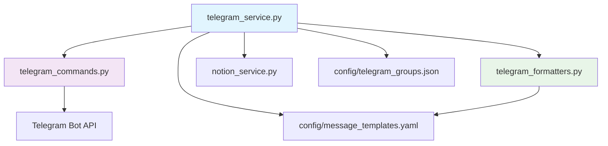
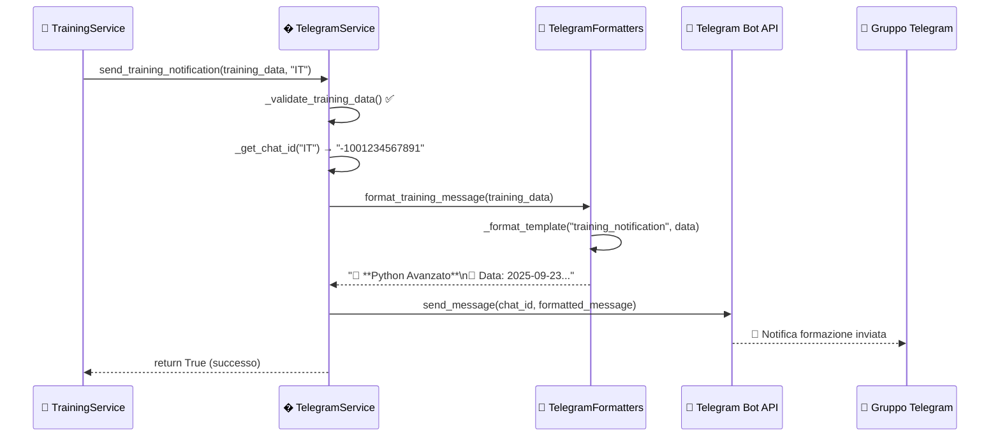
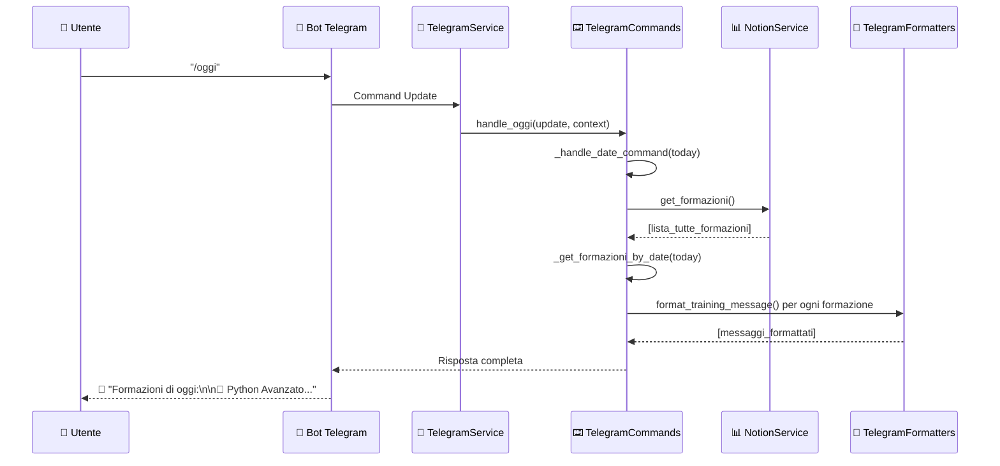
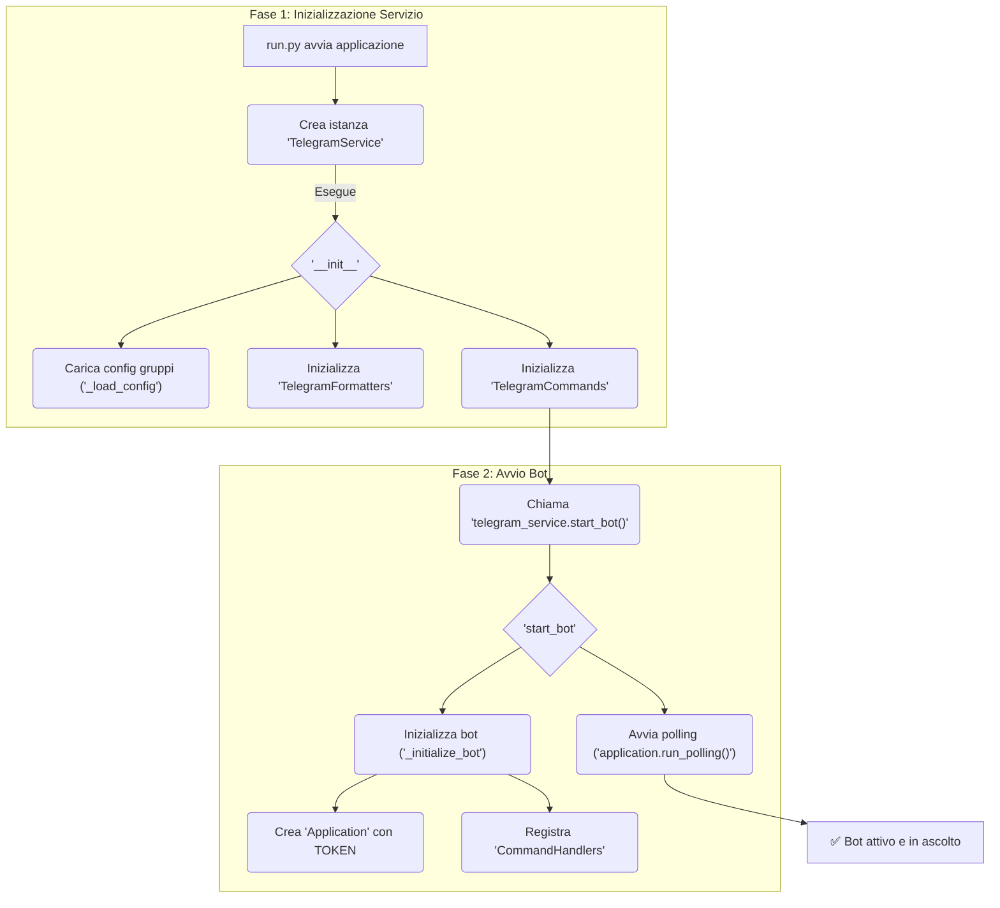

# 🤖 Bot Telegram - Documentazione Tecnica

**Sistema modulare per gestione notifiche e comandi Telegram**

---

## 📋 Indice

1. [🏗️ Architettura Generale](#-architettura-generale)
2. [📁 Struttura File](#-struttura-file)
3. [🔧 Componenti Core](#-componenti-core)
4. [⌨️ Sistema Comandi](#️-sistema-comandi)
5. [🎨 Formattazione Messaggi](#-formattazione-messaggi)
6. [⚙️ Configurazione](#️-configurazione)
7. [🔄 Flussi di Lavoro](#-flussi-di-lavoro)
8. [📊 API Reference](#-api-reference)

---

## 🏗️ Architettura Generale

### Design Pattern Utilizzato
Il sistema bot utilizza un **pattern modulare a responsabilità separate**:

```
📱 telegram_service.py (Orchestratore)
├── 🤖 Gestione connessione bot
├── 📨 Invio notifiche automatiche  
├── 🔗 Coordinamento tra moduli
└── 🎯 Business logic principale

⌨️ telegram_commands.py (Handler Comandi)
├── 🕐 Comandi temporali (/oggi, /domani, /settimana)
├── ℹ️ Comandi informativi (/help, /start)
├── 📅 Logica estrazione date
└── 🔍 Recupero dati formazioni

🎨 telegram_formatters.py (Formattazione)
├── 📝 Template YAML per messaggi
├── 🎯 Formattazione notifiche training
├── 📋 Formattazione richieste feedback
└── 🔄 Gestione messaggi dinamici
```

### Vantaggi dell'Architettura
- **🧩 Modularità**: Ogni componente ha una responsabilità specifica
- **🔧 Manutenibilità**: Modifiche isolate senza impatti laterali
- **🧪 Testabilità**: Ogni modulo può essere testato indipendentemente
- **📈 Scalabilità**: Facile aggiunta di nuovi comandi e formattatori

---

## 📁 Struttura File

### File e Responsabilità

```
📂 app/services/
├── 📱 telegram_service.py          # 🎯 Orchestratore principale
└── 📂 bot/
    ├── ⌨️ telegram_commands.py     # 🤖 Handler comandi utente
    └── 🎨 telegram_formatters.py   # 📝 Formattazione messaggi
```

### Dipendenze tra Moduli



---

## 🔧 Componenti Core

L'architettura del bot è basata su **tre componenti principali** che collaborano seguendo il pattern di **separazione delle responsabilità**. Analizziamo ogni componente partendo dai moduli di supporto verso l'orchestratore principale.

---

## ⌨️ `telegram_commands.py` - Handler Comandi

### 📋 Responsabilità
- 🕐 Gestione comandi temporali (`/oggi`, `/domani`, `/settimana`)
- ℹ️ Comandi informativi (`/help`, `/start`)
- 📅 Parsing e manipolazione date
- � Interfaccia con Notion per recupero dati formazioni

### 🎯 Architettura Interna

La classe `TelegramCommands` utilizza un **pattern di delega** dove ogni comando pubblico delega la logica a metodi privati specializzati:

```
👤 Utente: /oggi
    ↓
📱 handle_oggi() → _handle_date_command(oggi)
    ↓
🔍 _handle_date_command() → _get_formazioni_by_date()
    ↓
� notion_service.get_formazioni() + _extract_date_from_formazione()
    ↓
🎨 formatter.format_training_message()
    ↓
📤 Risposta formattata all'utente
```

### 📚 API Completa

#### 🌐 Metodi Pubblici (Command Handlers)

```python
async def handle_oggi(self, update: Update, context: ContextTypes.DEFAULT_TYPE) -> None
```
**Scopo:** Gestisce comando `/oggi` per formazioni odierne  
**Flusso:** `handle_oggi()` → `_handle_date_command(datetime.now().date())`  
**Risposta:** Lista formazioni del giorno corrente o messaggio "nessuna formazione"

```python
async def handle_domani(self, update: Update, context: ContextTypes.DEFAULT_TYPE) -> None
```
**Scopo:** Gestisce comando `/domani` per formazioni del giorno successivo  
**Flusso:** `handle_domani()` → `_handle_date_command(datetime.now().date() + timedelta(days=1))`  
**Risposta:** Lista formazioni di domani

```python
async def handle_settimana(self, update: Update, context: ContextTypes.DEFAULT_TYPE) -> None
```
**Scopo:** Gestisce comando `/settimana` per formazioni della settimana corrente  
**Flusso:** `handle_settimana()` → `_handle_week_command()` → `_get_formazioni_by_date_range()`  
**Risposta:** Lista formazioni raggruppate per giorno della settimana

```python
async def handle_help(self, update: Update, context: ContextTypes.DEFAULT_TYPE) -> None
```
**Scopo:** Mostra guida comandi disponibili  
**Flusso:** Diretto, nessuna delega (formatta messaggio help statico)  
**Risposta:** Lista comandi con descrizioni

#### 🔒 Metodi Privati (Core Logic)

```python
def _handle_date_command(self, target_date: date) -> str
```
**Scopo:** **Metodo centrale** per gestione comandi basati su data singola  
**Utilizzato da:** `handle_oggi()`, `handle_domani()`  
**Flusso interno:**
1. Chiama `_get_formazioni_by_date(target_date)`
2. Se formazioni trovate → `formatter.format_training_message()` per ogni formazione
3. Se nessuna formazione → messaggio "Nessuna formazione per [data]"  
**Ritorna:** Messaggio formattato completo

```python
def _handle_week_command(self) -> str
```
**Scopo:** Gestione specifica comando settimana con logica raggruppamento  
**Utilizzato da:** `handle_settimana()`  
**Flusso interno:**
1. Calcola inizio/fine settimana corrente
2. Chiama `_get_formazioni_by_date_range(start, end)`
3. Raggruppa formazioni per giorno usando `_get_day_name()`
4. Formatta ogni gruppo con `formatter.format_training_message()`  
**Ritorna:** Messaggio strutturato per giorni della settimana

```python
def _get_formazioni_by_date(self, target_date: date) -> List[dict]
```
**Scopo:** **Filtro principale** per formazioni per data specifica  
**Utilizzato da:** `_handle_date_command()`  
**Flusso interno:**
1. `notion_service.get_formazioni()` - recupera tutte le formazioni
2. Per ogni formazione: `_extract_date_from_formazione()` 
3. Filtra solo quelle con data = target_date  
**Ritorna:** Lista formazioni filtrate

```python
def _get_formazioni_by_date_range(self, start_date: date, end_date: date) -> List[dict]
```
**Scopo:** Filtro per range di date (utilizzato per settimana)  
**Utilizzato da:** `_handle_week_command()`  
**Flusso interno:**
1. `notion_service.get_formazioni()`
2. Per ogni formazione: `_extract_date_from_formazione()`
3. Filtra start_date ≤ data ≤ end_date  
**Ritorna:** Lista formazioni nel range

```python
def _extract_date_from_formazione(self, formazione: dict) -> date
```
**Scopo:** **Parser date** - estrae data da oggetto formazione Notion  
**Utilizzato da:** `_get_formazioni_by_date()`, `_get_formazioni_by_date_range()`  
**Logica:** Gestisce diversi formati campo data Notion (ISO, timestamp, etc.)  
**Ritorna:** Oggetto `date` Python

```python
def _extract_time_from_formazione(self, formazione: dict) -> str
```
**Scopo:** Estrazione orario formattato per display  
**Utilizzato da:** Formattazione messaggi (indirettamente via formatter)  
**Ritorna:** Stringa orario formato "HH:MM-HH:MM"

```python
def _get_day_name(self, date_obj: date) -> str
```
**Scopo:** Conversione data in nome giorno italiano  
**Utilizzato da:** `_handle_week_command()` per raggruppamento  
**Ritorna:** Nome giorno localizzato ("Lunedì", "Martedì", etc.)

### 🔄 Flussi di Interazione Dettagliati

#### Comando `/oggi` - Flusso Completo
```
👤 /oggi → handle_oggi()
              ↓
         _handle_date_command(today)
              ↓
         _get_formazioni_by_date(today)
              ↓
         notion_service.get_formazioni() + _extract_date_from_formazione()
              ↓
         [Lista formazioni filtrate]
              ↓
         formatter.format_training_message() per ogni formazione
              ↓
         📤 "📅 Formazioni di oggi:\n\n🎯 Python Avanzato..."
```

#### Comando `/settimana` - Flusso Completo
```
👤 /settimana → handle_settimana()
                    ↓
               _handle_week_command()
                    ↓
               _get_formazioni_by_date_range(lun, dom)
                    ↓
               Raggruppamento per _get_day_name()
                    ↓
               📤 "📆 Formazioni della settimana:\n\n**Lunedì**\n🎯 Python..."
```

---

## 🎨 `telegram_formatters.py` - Formattazione Messaggi

### 📋 Responsabilità
- � Caricamento e gestione template YAML
- 🎯 Formattazione messaggi di notifica training
- 📋 Formattazione richieste feedback
- 🔄 Interpolazione dinamica variabili nei template

### 🎯 Architettura Template System

Il formatter utilizza un **sistema di template centralizzato** basato su YAML con interpolazione dinamica:

```
📁 config/message_templates.yaml
    ↓
� _load_templates() al startup
    ↓
💾 self.templates (cache in memoria)
    ↓ 
🎨 format_*_message() → _format_template()
    ↓
📤 Messaggio finale interpolato
```

### 📚 API Completa

#### 🌐 Metodi Pubblici (Interfaccia Formattazione)

```python
def format_training_message(self, training_data: dict) -> str
```
**Scopo:** **Metodo principale** per formattazione notifiche training  
**Utilizzato da:** `TelegramCommands`, `TelegramService.send_training_notification()`  
**Flusso interno:**
1. Valida presenza chiavi richieste in `training_data`
2. Chiama `_format_template("training_notification", training_data)`
3. Applica escape caratteri speciali Telegram  
**Parametri richiesti:** `titolo`, `data`, `orario`, `docente`, `luogo`, `descrizione`  
**Ritorna:** Messaggio formattato con emoji e markdown

```python
def format_feedback_message(self, training_data: dict) -> str
```
**Scopo:** Formattazione richieste feedback post-training  
**Utilizzato da:** `TelegramService.send_feedback_request()`  
**Flusso interno:**
1. Estrae `titolo` e `data` da `training_data`
2. Chiama `_format_template("feedback_request", training_data)`  
**Parametri richiesti:** `titolo`, `data`  
**Ritorna:** Messaggio richiesta feedback interattivo

#### 🔒 Metodi Privati (Core Engine)

```python
def _load_templates(self) -> dict
```
**Scopo:** **Caricatore template** - inizializzazione sistema al startup  
**Chiamato da:** `__init__()`  
**Flusso interno:**
1. Apre file YAML `config/message_templates.yaml`
2. Parse YAML → dizionario Python
3. Valida presenza template obbligatori
4. Cache risultato in `self.templates`  
**Gestione errori:** FileNotFoundError, YAMLError con fallback template di default  
**Ritorna:** Dizionario template caricati

```python
def _format_template(self, template_name: str, data: dict) -> str
```
**Scopo:** **Engine di interpolazione** - sostituisce placeholder con dati reali  
**Utilizzato da:** `format_training_message()`, `format_feedback_message()`  
**Flusso interno:**
1. Recupera template da `self.templates[template_name]`
2. Applica `.format(**data)` per interpolazione `{variabile}`
3. Gestisce errori KeyError per placeholder mancanti  
**Algoritmo interpolazione:** 
   - Placeholder formato `{nome_variabile}`
   - Sostituzione diretta con `str.format()`
   - Fallback a stringa vuota per chiavi mancanti  
**Ritorna:** Template interpolato completo

```python
def _validate_training_data(self, training_data: dict) -> bool
```
**Scopo:** Validatore dati per messaggi training  
**Utilizzato da:** `format_training_message()`  
**Controlla presenza:** `['titolo', 'data', 'orario', 'docente', 'luogo', 'descrizione']`  
**Ritorna:** `True` se tutti i campi presenti, `False` altrimenti

```python
def _escape_markdown(self, text: str) -> str
```
**Scopo:** Escape caratteri speciali Telegram markdown  
**Utilizzato da:** `_format_template()` (post-processing)  
**Caratteri escape:** `*`, `_`, `[`, `]`, `(`, `)`, `~`, ``` ` ```, `>`, `#`, `+`, `-`, `=`, `|`, `{`, `}`, `.`, `!`  
**Ritorna:** Testo con caratteri escaped

### 🔄 Flussi di Formattazione Dettagliati

#### Formattazione Training Message - Flusso Completo
```
📊 training_data = {
    'titolo': 'Python Avanzato',
    'data': '2025-09-23',
    'orario': '14:00-17:00',
    ...
}
    ↓
🎨 format_training_message(training_data)
    ↓
✅ _validate_training_data() → controlla chiavi obbligatorie
    ↓
🔄 _format_template("training_notification", training_data)
    ↓
📝 Template YAML "training_notification":
   "🎯 **{titolo}**\n📅 Data: {data}\n🕐 Orario: {orario}..."
    ↓
🔄 str.format() → sostituisce {titolo} con 'Python Avanzato'
    ↓
🛡️ _escape_markdown() → escape caratteri speciali
    ↓
📤 "🎯 **Python Avanzato**\n📅 Data: 2025-09-23\n🕐 Orario: 14:00-17:00..."
```

#### Gestione Template System - Startup
```
🚀 TelegramFormatters.__init__(templates_path)
    ↓
📁 _load_templates()
    ↓
📄 with open('config/message_templates.yaml')
    ↓
🔄 yaml.safe_load() → parse YAML
    ↓
✅ Validazione template obbligatori:
   - training_notification ✓
   - feedback_request ✓
    ↓
💾 self.templates = {...} → cache in memoria
    ↓
⚡ Formatter pronto per uso
```

---

## 📱 `telegram_service.py` - Orchestratore Principale

### 📋 Responsabilità
- 🤖 **Gestione lifecycle bot** - Inizializzazione, startup, shutdown
- 📨 **Orchestrazione invio messaggi** - Notifiche automatiche e manuali
- 🔗 **Coordinamento servizi** - Integrazione Notion, Commands, Formatters
- ⚙️ **Gestione configurazione** - Caricamento gruppi, template, credenziali
- 🛡️ **Error handling centralizzato** - Retry logic, fallback, logging

### 🎯 Ruolo di Orchestratore

`TelegramService` è il **punto di ingresso principale** che coordina tutti gli altri componenti:

```
🌐 Flask Routes / Training Service
    ↓
📱 TelegramService (Orchestratore)
    ├─→ 🎨 TelegramFormatters (formattazione)
    ├─→ ⌨️ TelegramCommands (handler comandi)
    ├─→ 📊 NotionService (dati)
    └─→ 🤖 python-telegram-bot (API)
```

### 📚 API Completa

#### 🌐 Metodi Pubblici (Interfaccia Esterna)

```python
async def send_training_notification(self, training_data: dict, area: str = "main_group") -> bool
```
**Scopo:** **Metodo principale** per invio notifiche formazione automatiche  
**Utilizzato da:** `TrainingService`, Routes Flask  
**Flusso completo:**
1. `_validate_training_data(training_data)` → validazione input
2. `_get_chat_id(area)` → risoluzione ID gruppo destinazione  
3. `self.formatter.format_training_message(training_data)` → formattazione messaggio
4. `_send_message(chat_id, formatted_message)` → invio con retry logic  
**Parametri:**
- `training_data`: Dizionario con dati formazione (titolo, data, docente, etc.)
- `area`: Chiave area aziendale ("IT", "HR", "main_group", etc.)  
**Ritorna:** `bool` - `True` se invio riuscito, `False` se fallito  
**Gestione errori:** Log dettagliato + fallback a main_group se area non trovata

```python
async def send_feedback_request(self, training_data: dict, area: str = "main_group") -> bool
```
**Scopo:** Invio richieste feedback post-formazione  
**Utilizzato da:** `TrainingService` (trigger temporale post-training)  
**Flusso completo:**
1. `_validate_feedback_data(training_data)` → validazione campi minimi
2. `_get_chat_id(area)` → risoluzione gruppo
3. `self.formatter.format_feedback_message(training_data)` → formattazione
4. `_send_message(chat_id, formatted_message)` → invio  
**Parametri:** Analoghi a `send_training_notification`  
**Ritorna:** `bool` - Successo/fallimento

```python
async def start_bot(self) -> None
```
**Scopo:** **Avvio bot** in modalità polling per comandi interattivi  
**Utilizzato da:** Applicazione principale (`run.py`)  
**Flusso completo:**
1. `_initialize_bot()` → setup bot e registrazione handlers
2. `application.run_polling()` → avvio polling Telegram  
**Modalità:** Asincrona, non bloccante  
**Handler registrati:** `/start`, `/help`, `/oggi`, `/domani`, `/settimana`

```python
async def stop_bot(self) -> None
```
**Scopo:** Shutdown graceful del bot  
**Flusso:** `application.stop()` + cleanup risorse  
**Utilizzo:** Gestione SIGTERM, shutdown applicazione

#### 🔒 Metodi Privati (Core Implementation)

```python
def _initialize_bot(self) -> None
```
**Scopo:** **Setup centrale bot** - configurazione e registrazione handlers  
**Chiamato da:** `start_bot()`  
**Flusso interno:**
1. `Application.builder().token(TELEGRAM_BOT_TOKEN).build()` → crea bot instance
2. Inizializza `self.commands = TelegramCommands(notion_service, formatter)`
3. Registra command handlers:
   - `CommandHandler("oggi", self.commands.handle_oggi)`
   - `CommandHandler("domani", self.commands.handle_domani)`
   - `CommandHandler("settimana", self.commands.handle_settimana)`
   - `CommandHandler("help", self.commands.handle_help)`
   - `CommandHandler("start", self.commands.handle_help)`
4. Configura error handler globale  
**Risultato:** Bot completamente configurato e pronto

```python
def _load_config(self, config_path: str) -> dict
```
**Scopo:** **Caricatore configurazione gruppi** Telegram  
**Chiamato da:** `__init__()`  
**Flusso interno:**
1. Carica `config/telegram_groups.json`
2. Valida presenza `main_group`
3. Parse JSON → dizionario mapping area→chat_id  
**Gestione errori:** FileNotFoundError con config di default  
**Ritorna:** Dizionario configurazione gruppi

```python
def _get_chat_id(self, area: str) -> str
```
**Scopo:** **Resolver chat ID** - mappa area aziendale a ID gruppo Telegram  
**Utilizzato da:** `send_training_notification()`, `send_feedback_request()`  
**Logica:**
1. Cerca `area` in `self.config`
2. Se non trovata → fallback a `self.config["main_group"]`
3. Log warning se fallback utilizzato  
**Parametri:** `area` - chiave area ("IT", "HR", "Commerciale", etc.)  
**Ritorna:** Chat ID Telegram (formato `-1001234567890`)

```python
async def _send_message(self, chat_id: str, message: str, retry_count: int = 3) -> bool
```
**Scopo:** **Engine invio messaggi** con retry logic e error handling  
**Utilizzato da:** `send_training_notification()`, `send_feedback_request()`  
**Flusso interno:**
1. `bot.send_message(chat_id, message, parse_mode='Markdown')`
2. Se errore → wait exponential backoff + retry
3. Log dettagliato successo/fallimento per ogni tentativo  
**Retry Logic:**
   - Max 3 tentativi
   - Backoff: 1s, 2s, 4s
   - Retry su: NetworkError, TimedOut
   - No retry su: Forbidden, ChatNotFound  
**Ritorna:** `bool` - `True` solo se invio definitivamente riuscito

```python
def _validate_training_data(self, training_data: dict) -> bool
```
**Scopo:** Validatore dati training completo  
**Utilizzato da:** `send_training_notification()`  
**Validazioni:**
- Presenza chiavi obbligatorie: `['titolo', 'data', 'orario', 'docente', 'luogo']`
- Tipo dati corretti (`data` come date/string, etc.)
- Lunghezza campi ragionevole (titolo max 200 char, etc.)  
**Ritorna:** `bool` + log errori specifici

```python
def _validate_feedback_data(self, training_data: dict) -> bool
```
**Scopo:** Validatore dati feedback (subset di training)  
**Utilizzato da:** `send_feedback_request()`  
**Validazioni minime:** `['titolo', 'data']`  
**Ritorna:** `bool`

### 🔄 Flussi di Orchestrazione Dettagliati

#### Invio Notifica Training - Flusso Completo End-to-End
```
🌐 TrainingService.notify_new_training(training_data, "IT")
    ↓
📱 telegram_service.send_training_notification(training_data, "IT")
    ↓
✅ _validate_training_data(training_data) → verifica campi obbligatori
    ↓ [OK]
🔍 _get_chat_id("IT") → cerca config["IT"] → "-1001234567891"
    ↓
🎨 self.formatter.format_training_message(training_data)
    ↓ [Messaggio formattato]
📤 _send_message("-1001234567891", formatted_message)
    ↓
🤖 bot.send_message(chat_id, message, parse_mode='Markdown')
    ↓ [Telegram API]
✅ return True → Notifica inviata con successo
    ↓
📝 Log: "Training notification sent successfully to IT group"
```

#### Startup Bot - Flusso Completo
```
🚀 run.py → telegram_service.start_bot()
    ↓
🔧 _initialize_bot()
    ↓
🤖 Application.builder().token(TOKEN).build() → crea bot instance
    ↓
⌨️ self.commands = TelegramCommands(notion_service, self.formatter)
    ↓
📋 Registrazione handlers:
   application.add_handler(CommandHandler("oggi", self.commands.handle_oggi))
   application.add_handler(CommandHandler("domani", self.commands.handle_domani))
   application.add_handler(CommandHandler("settimana", self.commands.handle_settimana))
   application.add_handler(CommandHandler("help", self.commands.handle_help))
   application.add_handler(CommandHandler("start", self.commands.handle_help))
    ↓
🔄 application.run_polling() → avvio polling Telegram
    ↓
✅ Bot attivo e in ascolto per comandi
```

#### Gestione Comando Utente - Flusso Cross-Component
```
👤 Utente invia "/oggi" nel gruppo Telegram
    ↓
🤖 Telegram API → Bot riceve update
    ↓
📱 telegram_service (dispatcher) → identifica CommandHandler("oggi")
    ↓
⌨️ self.commands.handle_oggi(update, context)
    ↓
📅 commands._handle_date_command(datetime.now().date())
    ↓
🔍 commands._get_formazioni_by_date(today)
    ↓
📊 notion_service.get_formazioni() → recupera tutte le formazioni
    ↓
🔄 Filtro per data odierna usando _extract_date_from_formazione()
    ↓ [Lista formazioni oggi]
🎨 self.formatter.format_training_message() per ogni formazione
    ↓ [Messaggi formattati]
📤 Bot invia risposta all'utente nel gruppo
    ↓
✅ Comando completato
```

## ⌨️ Sistema Comandi - Riassunto

### Comandi Disponibili

| Comando | Descrizione | Funzionalità |
|---------|-------------|--------------|
| `/start` | 🚀 Inizializzazione bot | Messaggio di benvenuto e istruzioni |
| `/help` | ℹ️ Guida comandi | Lista completa comandi disponibili |
| `/oggi` | 📅 Formazioni oggi | Elenco formazioni della giornata corrente |
| `/domani` | ⏭️ Formazioni domani | Elenco formazioni del giorno successivo |
| `/settimana` | 📆 Formazioni settimana | Elenco formazioni della settimana corrente |

### Registrazione Handler nel Sistema

Il sistema utilizza il pattern **Command Handler** di python-telegram-bot per mappare comandi a funzioni:

```python
# In telegram_service._initialize_bot()
application.add_handler(CommandHandler("oggi", self.commands.handle_oggi))
application.add_handler(CommandHandler("domani", self.commands.handle_domani))
application.add_handler(CommandHandler("settimana", self.commands.handle_settimana))
application.add_handler(CommandHandler("help", self.commands.handle_help))
application.add_handler(CommandHandler("start", self.commands.handle_help))
```

Quando un utente invia `/oggi`, Telegram API invia un update al bot, che viene automaticamente instradato a `self.commands.handle_oggi()`.

---

## 🎨 Formattazione Messaggi - Riassunto

### Sistema Template Centralizzato

Il sistema utilizza **template YAML centralizzati** che permettono:

- **🌐 Multilingua**: Facile traduzione modificando solo i template
- **🎨 Consistenza**: Tutti i messaggi seguono lo stesso stile
- **🔧 Manutenibilità**: Modifiche al formato senza toccare il codice
- **📝 Personalizzazione**: Template specifici per diversi tipi di messaggio

### Esempio Template YAML

```yaml
# config/message_templates.yaml
training_notification:
  title: "🎯 Nuova Formazione Programmata"
  content: |
    📚 **{titolo}**
    📅 Data: {data}
    🕐 Orario: {orario}
    👨‍🏫 Docente: {docente}
    📍 Luogo: {luogo}
    
    📝 Descrizione:
    {descrizione}

feedback_request:
  title: "📊 Richiesta Feedback"
  content: |
    Ciao! Come è andata la formazione su **{titolo}**?
    
    Per favore, condividi il tuo feedback:
    ⭐ Valutazione (1-5):
    💬 Commenti:
    📈 Suggerimenti:
```

Il processo di **interpolazione dinamica** sostituisce i placeholder `{variabile}` con i dati reali delle formazioni.

---

## ⚙️ Configurazione del Sistema

### File di Configurazione Principali

#### 🔧 `config/telegram_groups.json`
Mapping delle aree aziendali agli ID dei gruppi Telegram:

```json
{
  "_comment": "Configurazione gruppi Telegram",
  "main_group": "-1001234567890",
  "IT": "-1001234567891", 
  "HR": "-1001234567892",
  "R&D": "-1001234567893",
  "Commerciale": "-1001234567894",
  "Marketing": "-1001234567895",
  "Legale": "-1001234567896"
}
```

#### 📝 `config/message_templates.yaml`
Template per messaggi formattati (vedi sezione Formattazione)

#### 🔐 `.env`
Variabili ambiente sensibili:

```env
TELEGRAM_BOT_TOKEN=123456789:ABCdefGHIjklMNOpqrSTUvwxyz
NOTION_TOKEN=secret_notion_integration_token
```

### Caricamento e Inizializzazione

Il sistema carica la configurazione seguendo questo pattern:

```python
# In TelegramService.__init__()
self.config = self._load_config('config/telegram_groups.json')         # Gruppi Telegram
self.formatter = TelegramFormatters('config/message_templates.yaml')   # Template messaggi  
self.commands = TelegramCommands(notion_service, self.formatter)       # Handler comandi

# Load delle variabili ambiente
load_dotenv()  # Carica .env con TELEGRAM_BOT_TOKEN
```

---

## 🔄 Flussi di Lavoro del Sistema

### 📨 Scenario: Invio Notifica Training Automatica

**Trigger:** `TrainingService` rileva nuova formazione programmata per domani



### ⌨️ Scenario: Comando Utente Interattivo

**Trigger:** Utente scrive `/oggi` nel gruppo Telegram



### � Scenario: Startup Sistema Completo



---

## 📊 API Reference Dettagliata


### Error Codes e Gestione

| Errore | Codice | Gestione | Retry |
|--------|--------|----------|--------|
| **NetworkError** | TCP/SSL | Exponential backoff | ✅ 3 tentativi |
| **TimedOut** | Timeout API | Backoff + retry | ✅ 3 tentativi |
| **Forbidden** | Bot non autorizzato | Log + fallback main_group | ❌ No retry |
| **ChatNotFound** | Gruppo non esistente | Log + fallback main_group | ❌ No retry |
| **ValidationError** | Dati malformati | Log dettagliato + return False | ❌ No retry |

---

## 🧵 Gestione dei Topic (Thread) di Gruppo

Per migliorare l'organizzazione delle notifiche all'interno dei gruppi Telegram, è stato implementato il supporto per l'invio di messaggi in **topic specifici** (chiamati anche *threads*).

### 1. Modifica della Configurazione

Il file `config/telegram_groups.json` è stato aggiornato per supportare questa funzionalità. La struttura per ogni gruppo è stata trasformata da una stringa a un oggetto JSON.

**Formato Precedente:**
```json
{
  "IT": "-1003002711100"
}
```

**Nuovo Formato:**
```json
{
  "IT": {
    "chat_id": "-1003002711100",
    "topic_id": 2
  },
  "R&D": {
    "chat_id": "-1002521246693"
  }
}
```

- **`chat_id`** (obbligatorio): L'identificativo del gruppo Telegram.
- **`topic_id`** (opzionale): L'identificativo numerico del topic in cui inviare il messaggio. Se omesso, il messaggio verrà inviato nella chat generale ("General") del gruppo.

### 2. Aggiornamento della Logica di Invio

La funzione `send_message_to_group` in `app/services/telegram_service.py` è stata modificata per gestire la nuova struttura.

**Logica di Funzionamento:**

1.  Quando viene richiesto l'invio a un gruppo (es. "IT"), la funzione legge l'oggetto di configurazione corrispondente.
2.  Estrae il `chat_id` e verifica la presenza di un `topic_id`.
3.  Se `topic_id` è presente, viene aggiunto alla chiamata API di Telegram tramite il parametro `message_thread_id`.

**Estratto del codice aggiornato:**
```python
# in telegram_service.py

async def send_message_to_group(self, group_key: str, message: str, parse_mode: str = 'HTML') -> bool:
    # ... (validazione iniziale)

    group_config = self.groups[group_key]
    
    chat_id = group_config.get('chat_id')
    topic_id = group_config.get('topic_id')

    # ... (controllo se chat_id esiste)

    try:
        kwargs = {
            'chat_id': chat_id,
            'text': message,
            'parse_mode': parse_mode
        }
        if topic_id:
            kwargs['message_thread_id'] = topic_id
        
        await self.bot.send_message(**kwargs)
        # ... (logging e return)
```

Questo approccio garantisce la massima flessibilità: è possibile decidere per ogni singolo gruppo se utilizzare un topic specifico o meno, semplicemente modificando il file di configurazione JSON, senza bisogno di ulteriori interventi sul codice.

---

*Documentazione aggiornata al 19/10/2025 - Versione 2.1*
