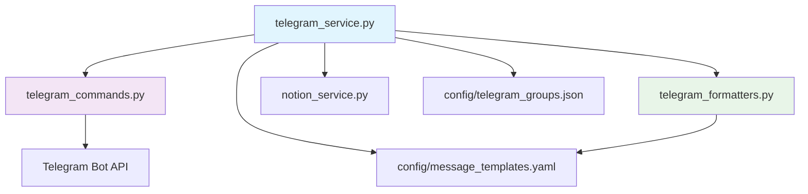
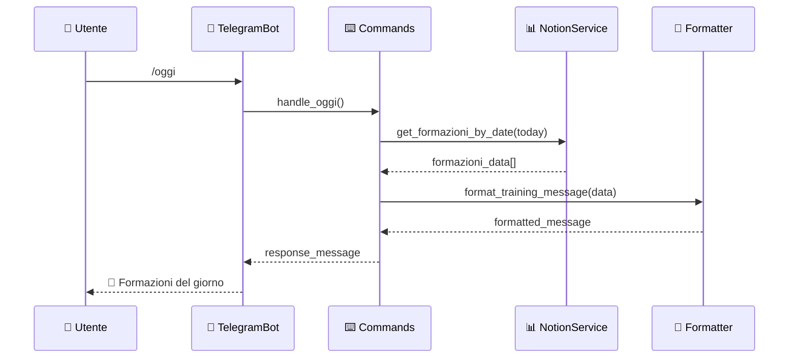
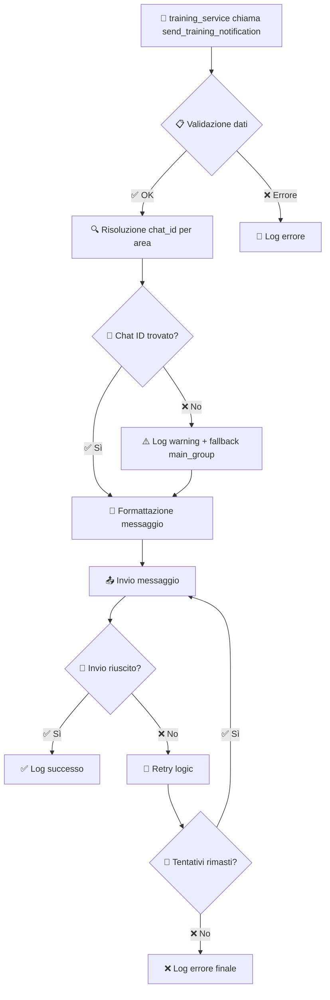

# 🤖 Bot Telegram - Documentazione Tecnica

**Sistema modulare per gestione notifiche e comandi Telegram**

---

## 📋 Indice

1. [🏗️ Architettura Generale](#-architettura-generale)
2. [📁 Struttura File](#-struttura-file)
3. [🔧 Componenti Core](#-componenti-core)
4. [⌨️ Sistema Comandi](#️-sistema-comandi)
5. [🎨 Formattazione Messaggi](#-formattazione-messaggi)
6. [⚙️ Configurazione](#️-configurazione)
7. [🔄 Flussi di Lavoro](#-flussi-di-lavoro)
8. [📊 API Reference](#-api-reference)

---

## 🏗️ Architettura Generale

### Design Pattern Utilizzato
Il sistema bot utilizza un **pattern modulare a responsabilità separate**:

```
📱 telegram_service.py (Orchestratore)
├── 🤖 Gestione connessione bot
├── 📨 Invio notifiche automatiche  
├── 🔗 Coordinamento tra moduli
└── 🎯 Business logic principale

⌨️ telegram_commands.py (Handler Comandi)
├── 🕐 Comandi temporali (/oggi, /domani, /settimana)
├── ℹ️ Comandi informativi (/help, /start)
├── 📅 Logica estrazione date
└── 🔍 Recupero dati formazioni

🎨 telegram_formatters.py (Formattazione)
├── 📝 Template YAML per messaggi
├── 🎯 Formattazione notifiche training
├── 📋 Formattazione richieste feedback
└── 🔄 Gestione messaggi dinamici
```

### Vantaggi dell'Architettura
- **🧩 Modularità**: Ogni componente ha una responsabilità specifica
- **🔧 Manutenibilità**: Modifiche isolate senza impatti laterali
- **🧪 Testabilità**: Ogni modulo può essere testato indipendentemente
- **📈 Scalabilità**: Facile aggiunta di nuovi comandi e formattatori

---

## 📁 Struttura File

### File e Responsabilità

```
📂 app/services/
├── 📱 telegram_service.py          # 🎯 Orchestratore principale
└── 📂 bot/
    ├── ⌨️ telegram_commands.py     # 🤖 Handler comandi utente
    └── 🎨 telegram_formatters.py   # 📝 Formattazione messaggi
```

### Dipendenze tra Moduli



---

## 🔧 Componenti Core

### 📱 `telegram_service.py` - Orchestratore Principale

**Responsabilità:**
- 🤖 Inizializzazione e gestione bot Telegram
- 📨 Invio notifiche automatiche di formazione
- 📋 Invio richieste di feedback
- 🔗 Coordinamento tra servizi (Notion, formatters, commands)

**Classe Principale:**
```python
class TelegramService:
    def __init__(self, config_path: str)
    async def send_training_notification(self, training_data: dict, area: str)
    async def send_feedback_request(self, training_data: dict, area: str) 
    async def start_bot(self)
    async def stop_bot(self)
```

**Metodi Chiave:**
- `_initialize_bot()` - Setup bot e handlers
- `_load_config()` - Caricamento configurazioni
- `_send_message()` - Invio messaggi con retry logic
- `_get_chat_id()` - Risoluzione ID gruppi

### ⌨️ `telegram_commands.py` - Handler Comandi

**Responsabilità:**
- 🕐 Gestione comandi temporali (`/oggi`, `/domani`, `/settimana`)
- ℹ️ Comandi informativi (`/help`, `/start`)
- 📅 Parsing e manipolazione date
- 🔍 Interfaccia con Notion per recupero dati

**Classe Principale:**
```python
class TelegramCommands:
    def __init__(self, notion_service, formatter)
    async def handle_oggi(self, update: Update, context: ContextTypes.DEFAULT_TYPE)
    async def handle_domani(self, update: Update, context: ContextTypes.DEFAULT_TYPE)
    async def handle_settimana(self, update: Update, context: ContextTypes.DEFAULT_TYPE)
    async def handle_help(self, update: Update, context: ContextTypes.DEFAULT_TYPE)
```

**Utility Methods:**
- `_extract_date_from_formazione()` - Estrazione date da oggetti formazione
- `_extract_time_from_formazione()` - Estrazione orari
- `_get_day_name()` - Conversione date in nomi giorni italiani
- `_get_formazioni_by_date()` - Filtro formazioni per data
- `_get_formazioni_by_date_range()` - Filtro per range date

### 🎨 `telegram_formatters.py` - Formattazione Messaggi

**Responsabilità:**
- 📝 Caricamento template YAML
- 🎯 Formattazione messaggi di notifica training
- 📋 Formattazione richieste feedback
- 🔄 Gestione messaggi dinamici e personalizzati

**Classe Principale:**
```python
class TelegramFormatters:
    def __init__(self, templates_path: str)
    def format_training_message(self, training_data: dict) -> str
    def format_feedback_message(self, training_data: dict) -> str
    def _load_templates(self) -> dict
    def _format_template(self, template: str, data: dict) -> str
```

---

## ⌨️ Sistema Comandi

### Comandi Disponibili

| Comando | Descrizione | Funzionalità |
|---------|-------------|--------------|
| `/start` | 🚀 Inizializzazione bot | Messaggio di benvenuto e istruzioni |
| `/help` | ℹ️ Guida comandi | Lista completa comandi disponibili |
| `/oggi` | 📅 Formazioni oggi | Elenco formazioni della giornata corrente |
| `/domani` | ⏭️ Formazioni domani | Elenco formazioni del giorno successivo |
| `/settimana` | 📆 Formazioni settimana | Elenco formazioni della settimana corrente |

### Implementazione Handler

```python
# Registrazione handler in telegram_service.py
application.add_handler(CommandHandler("oggi", self.commands.handle_oggi))
application.add_handler(CommandHandler("domani", self.commands.handle_domani))
application.add_handler(CommandHandler("settimana", self.commands.handle_settimana))
application.add_handler(CommandHandler("help", self.commands.handle_help))
application.add_handler(CommandHandler("start", self.commands.handle_help))
```

### Flusso Gestione Comandi



---

## 🎨 Formattazione Messaggi

### Sistema Template YAML

Il sistema utilizza template YAML per messaggi dinamici e multilingua:

```yaml
# config/message_templates.yaml
training_notification:
  title: "🎯 Nuova Formazione Programmata"
  content: |
    📚 **{titolo}**
    📅 Data: {data}
    🕐 Orario: {orario}
    👨‍🏫 Docente: {docente}
    📍 Luogo: {luogo}
    
    📝 Descrizione:
    {descrizione}

feedback_request:
  title: "📊 Richiesta Feedback"
  content: |
    Ciao! Come è andata la formazione su **{titolo}**?
    
    Per favore, condividi il tuo feedback:
    ⭐ Valutazione (1-5):
    💬 Commenti:
    📈 Suggerimenti:
```

### Processo di Formattazione

1. **📥 Caricamento Template**: Lettura file YAML al startup
2. **🔄 Sostituzioni Dinamiche**: Placeholder `{variabile}` sostituiti con dati reali
3. **🎨 Formattazione**: Applicazione stili Telegram (markdown)
4. **📤 Output**: Messaggio pronto per invio

### Metodi di Formattazione

```python
# Formattazione notifica training
formatted_msg = formatter.format_training_message({
    'titolo': 'Python Avanzato',
    'data': '2025-09-23',
    'orario': '14:00-17:00',
    'docente': 'Mario Rossi',
    'luogo': 'Sala Conferenze A',
    'descrizione': 'Corso avanzato Python...'
})

# Formattazione richiesta feedback  
feedback_msg = formatter.format_feedback_message({
    'titolo': 'Python Avanzato',
    'data': '2025-09-23'
})
```

---

## ⚙️ Configurazione

### File di Configurazione

#### 🔧 `config/telegram_groups.json`
Mapping delle aree aziendali agli ID dei gruppi Telegram:

```json
{
  "_comment": "Configurazione gruppi Telegram",
  "main_group": "-1001234567890",
  "IT": "-1001234567891", 
  "HR": "-1001234567892",
  "R&D": "-1001234567893",
  "Commerciale": "-1001234567894",
  "Marketing": "-1001234567895",
  "Legale": "-1001234567896"
}
```

#### 📝 `config/message_templates.yaml`
Template per messaggi formattati (vedi sezione Formattazione)

#### 🔐 `.env`
Variabili ambiente sensibili:

```env
TELEGRAM_BOT_TOKEN=123456789:ABCdefGHIjklMNOpqrSTUvwxyz
NOTION_TOKEN=secret_notion_integration_token
```

### Inizializzazione Configurazione

```python
# In telegram_service.py
class TelegramService:
    def __init__(self, config_path: str = 'config/telegram_groups.json'):
        self.config = self._load_config(config_path)
        self.formatter = TelegramFormatters('config/message_templates.yaml')
        self.commands = TelegramCommands(notion_service, self.formatter)
```

---

## 🔄 Flussi di Lavoro

### 📨 Invio Notifica Training



### ⌨️ Gestione Comando Utente

```mermaid
flowchart TD
    A[👤 Utente invia /oggi] --> B[🤖 Bot riceve comando]
    B --> C[⌨️ telegram_commands.handle_oggi()]
    C --> D[📅 Calcolo data corrente]
    D --> E[📊 notion_service.get_formazioni()]
    E --> F[🔍 Filtro per data odierna]
    F --> G{📋 Formazioni trovate?}
    
    G -->|✅ Sì| H[🎨 Formattazione lista formazioni]
    G -->|❌ No| I[📝 Messaggio "Nessuna formazione"]
    
    H --> J[📤 Invio risposta]
    I --> J
    J --> K[✅ Comando completato]
```

### 📊 Richiesta Feedback

```mermaid
flowchart TD
    A[⏰ Trigger temporale post-formazione] --> B[🎯 training_service rileva formazione completata]
    B --> C[📋 Raccolta dati formazione]
    C --> D[📱 telegram_service.send_feedback_request()]
    D --> E[🎨 Formattazione messaggio feedback]
    E --> F[🔍 Identificazione partecipanti]
    F --> G[📤 Invio richiesta feedback]
    G --> H[⏳ Attesa risposta utente]
    H --> I[📝 Raccolta e archiviazione feedback]
```

---

## 📊 API Reference

### TelegramService

#### Constructor
```python
TelegramService(config_path: str = 'config/telegram_groups.json')
```

#### Public Methods

```python
async def send_training_notification(
    self, 
    training_data: dict, 
    area: str = "main_group"
) -> bool
```
**Parametri:**
- `training_data`: Dizionario con dati formazione
- `area`: Area aziendale di destinazione

**Ritorna:** `bool` - Successo/fallimento invio

```python
async def send_feedback_request(
    self, 
    training_data: dict, 
    area: str = "main_group"
) -> bool
```
**Parametri:** Analoghi a `send_training_notification`

```python
async def start_bot() -> None
```
Avvia il bot in modalità polling

```python
async def stop_bot() -> None  
```
Arresta il bot gracefully

### TelegramCommands

#### Constructor
```python
TelegramCommands(notion_service, formatter: TelegramFormatters)
```

#### Command Handlers

```python
async def handle_oggi(
    self, 
    update: Update, 
    context: ContextTypes.DEFAULT_TYPE
) -> None
```

```python
async def handle_domani(
    self, 
    update: Update, 
    context: ContextTypes.DEFAULT_TYPE  
) -> None
```

```python
async def handle_settimana(
    self, 
    update: Update,
    context: ContextTypes.DEFAULT_TYPE
) -> None
```

```python
async def handle_help(
    self,
    update: Update,
    context: ContextTypes.DEFAULT_TYPE
) -> None
```

### TelegramFormatters

#### Constructor
```python
TelegramFormatters(templates_path: str = 'config/message_templates.yaml')
```

#### Formatting Methods

```python
def format_training_message(self, training_data: dict) -> str
```
**Parametri:**
- `training_data`: Deve contenere chiavi: `titolo`, `data`, `orario`, `docente`, `luogo`, `descrizione`

**Ritorna:** `str` - Messaggio formattato

```python
def format_feedback_message(self, training_data: dict) -> str
```
**Parametri:**
- `training_data`: Deve contenere chiavi: `titolo`, `data`

**Ritorna:** `str` - Messaggio formattato

---

## 🔧 Note Tecniche

### Gestione Errori
- **🔄 Retry Logic**: Tentativi multipli per invio messaggi
- **📝 Logging Dettagliato**: Tracciamento completo operazioni
- **🛡️ Fallback**: Uso main_group se area specifica non trovata

### Performance
- **⚡ Async/Await**: Gestione asincrona per performance
- **📦 Lazy Loading**: Caricamento configurazioni on-demand
- **🔄 Connection Pooling**: Riuso connessioni bot

### Security
- **🔐 Token Isolation**: Gestione sicura credenziali via .env
- **✅ Input Validation**: Sanitizzazione input utente
- **🛡️ Error Handling**: Gestione eccezioni senza leak informazioni

---

*Documentazione aggiornata al 22/09/2025 - Versione 1.0*