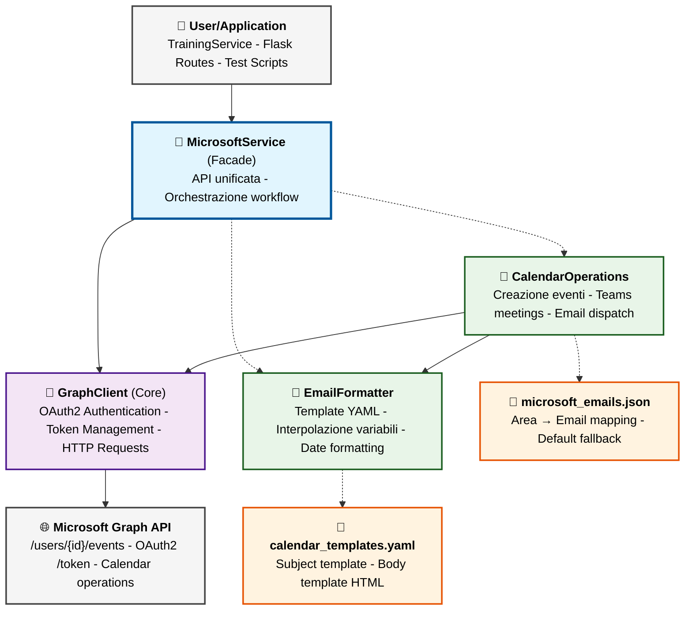

# 🔷 MicrosoftService - Documentazione Tecnica Modulare

> **Architettura modulare per integrazione Microsoft Graph API e Teams**  
> Versione 1.0 - Microsoft Teams Calendar Integration

## 📋 Indice

- [🏗️ Architettura Generale](#-architettura-generale)
- [📁 Struttura File](#-struttura-file)
- [🔐 graph_client.py - Core Authentication](#-graph_clientpy---core-authentication)
- [📝 email_formatter.py - Template Engine](#-email_formatterpy---template-engine)
- [📅 calendar_operations.py - Eventi e Meeting](#-calendar_operationspy---eventi-e-meeting)
- [🎯 __init__.py - Facade Unificata](#-__init__py---facade-unificata)
- [🔗 Pattern Architetturali](#-pattern-architetturali)
- [🚀 Esempi d'Uso](#-esempi-duso)
- [⚙️ Configurazione](#️-configurazione)

---

## 🏗️ Architettura Generale

### **Filosofia Modulare**
Il MicrosoftService segue lo **stesso pattern architetturale** del NotionService, con **3 moduli specializzati** che collaborano attraverso una facade unificata:

- **Single Responsibility Principle**: Ogni modulo ha una responsabilità specifica
- **Dependency Injection**: GraphClient iniettato nei moduli che lo richiedono
- **Facade Pattern**: API unificata che nasconde la complessità Microsoft Graph API
- **Template-Based Configuration**: Configurazione esterna via YAML/JSON

---

### **🎯 Grafo Architettura Modulare**



**🔄 Flow Operativo Tipico (Calendarizzazione Formazione):**
1. **User** chiama `microsoft.create_training_event(formazione_data)`
2. **MicrosoftService** (Facade) orchestra l'operazione
3. **EmailFormatter** genera subject e body da template YAML
4. **CalendarOperations** ottiene email destinatari da JSON (multi-area)
5. **GraphClient** acquisisce token OAuth2 da Microsoft
6. **CalendarOperations** crea evento via Graph API con payload completo
7. **Microsoft Graph API** crea evento + genera Teams meeting link
8. **MicrosoftService** ritorna risultato con event_id e teams_link

**💉 Dependency Injection Pattern:**
- `GraphClient` → Iniettato in `CalendarOperations`
- `EmailFormatter` → Iniettato in `CalendarOperations`

---

## 📁 Struttura File

```
app/services/microsoft/
├── __init__.py              # 🎯 Facade unificata (190 righe)
├── graph_client.py          # 🔐 Autenticazione OAuth2 (100 righe)
├── email_formatter.py       # 📝 Template engine YAML (170 righe)
└── calendar_operations.py   # 📅 Operazioni calendario (240 righe)

config/
├── microsoft_emails.json    # 📧 Mapping Area → Email
└── calendar_templates.yaml  # 📄 Template eventi calendario
```
---

## 🔐 graph_client.py - Core Authentication

### **Scopo Generale**
Modulo fondamentale che gestisce **autenticazione OAuth2 Client Credentials Flow** con Microsoft Graph API. Nasconde la complessità della gestione token e fornisce un'interfaccia semplice per HTTP requests autenticati.

### **Responsabilità Core**
- 🔐 **OAuth2 Authentication**: Acquisizione e refresh token automatico
- 🔑 **Token Management**: Cache token in memoria per performance
- 🌐 **HTTP Client**: Wrapper requests autenticati a Graph API
- ⚙️ **Configuration**: Caricamento credenziali da environment

---

### 📋 **Classe: GraphClient**

#### 🔧 `__init__(tenant_id: str, client_id: str, client_secret: str, user_email: str)`
**Scopo:** Inizializzazione client con credenziali Azure AD  
**Utilizzato da:** `MicrosoftService.__init__()` durante setup

**Parametri:**
- `tenant_id`: Azure AD Tenant ID (Directory ID)
- `client_id`: Application (client) ID della App Registration
- `client_secret`: Client secret generato in Azure
- `user_email`: Email organizzatore eventi (es: `lucadileo@jemore.it`)

**Gestione errori:**
- `ValueError`: Se parametri mancanti
- `Exception`: Se inizializzazione MSAL fallisce

**OAuth2 Scopes richiesti:**
```python
scopes = [
    "https://graph.microsoft.com/.default"
]
```
---

#### 🔑 `_get_access_token() -> str`
**Scopo:** Acquisizione token OAuth2 con cache automatica *(METODO CRITICO)*  
**Utilizzato da:** `make_request()` per ogni chiamata Graph API

**Flow di acquisizione:**
```python
1. Controlla cache token MSAL (in memoria)
2. Se token valido in cache → ritorna cached token
3. Se scaduto/assente → acquire_token_for_client()
4. Salva nuovo token in cache
5. Ritorna access_token
```

**Performance:** Cache evita chiamate ripetute a `/oauth2/v2.0/token` (migliora latenza ~200ms)

**Token lifetime:** ~1 ora (gestito automaticamente da MSAL)

**Gestione errori:**
- `GraphClientError`: Se acquisizione token fallisce (credenziali invalide, permessi mancanti)

**Esempio token response:**
```json
{
  "token_type": "Bearer",
  "expires_in": 3599,
  "access_token": "eyJ0eXAiOiJKV1QiLCJhbGc..."
}
```

---

#### 🌐 `make_request(method: str, endpoint: str, json_data: Dict = None) -> Dict`
**Scopo:** HTTP request autenticato a Microsoft Graph API *(WRAPPER PRINCIPALE)*  
**Utilizzato da:**
- `CalendarOperations.create_calendar_event()` per creazione eventi
- Tutte le operazioni Graph API

**Parametri:**
- `method`: HTTP method (`"GET"`, `"POST"`, `"PATCH"`, `"DELETE"`)
- `endpoint`: Graph API endpoint (es: `/users/{id}/events`)
- `json_data`: Payload JSON per POST/PATCH (opzionale)

**Headers automatici:**
```python
headers = {
    "Authorization": f"Bearer {access_token}",
    "Content-Type": "application/json"
}
```

**URL completo costruito:**
```
https://graph.microsoft.com/v1.0{endpoint}
```

**Gestione response:**
- Status 2xx → Parse JSON e ritorna Dict
- Status 4xx/5xx → Solleva `GraphClientError` con dettagli

**Esempio chiamata:**
```python
response = client.make_request(
    method="POST",
    endpoint=f"/users/{email}/events",
    json_data=event_payload
)
```

---

#### 📤 Getter Methods

##### `get_client() -> ConfidentialClientApplication`
**Scopo:** Accesso diretto al client MSAL (per operazioni avanzate)  
**Utilizzato da:** Raramente - solo per estensioni future

##### `get_user_email() -> str`
**Scopo:** Email organizzatore configurato  
**Utilizzato da:** `CalendarOperations` per costruire endpoint `/users/{email}/events`

---

### **⚙️ Configurazione Azure AD Richiesta**

1.  ***Registra un'Applicazione su Azure:***
    -   Vai su [portal.azure.com](https://www.google.com/search?q=https://portal.azure.com) e accedi con un account amministratore del tuo tenant Microsoft 365.
    -   Cerca e seleziona "**Azure Active Directory**".
    -   Nel menu a sinistra, vai su "**Registrazioni app**" -> "**+ Nuova registrazione**".
    -   Dalle un nome (es. "Automazione Formazioni App"). Lascia il resto di default e clicca "**Registra**".

2.  ***Ottieni Client ID e Tenant ID:***
    -   Nella pagina di Panoramica della tua nuova app, vedrai l'**ID applicazione (client)** e l'**ID directory (tenant)**. Copiali entrambi.

3.  ***Crea un Client Secret:***
    -   Nel menu a sinistra, vai su "**Certificati e segreti**" -> "**+ Nuovo segreto client**".
    -   Dagli una descrizione e una durata (es. 12 mesi). Clicca "Aggiungi".
    -   **IMPORTANTE:** Copia subito il **Valore** del segreto. Appena lasci la pagina, non potrai più visualizzarlo.

4.  ***Imposta le Autorizzazioni API:***
    -   Nel menu a sinistra, vai su "**Autorizzazioni API**" -> "**+ Aggiungi un'autorizzazione**".
    -   Scegli "**Microsoft Graph**".
    -   Scegli "**Autorizzazioni dell'applicazione**" (NON delegate). Questo permette al tuo server di agire in autonomia.
    -   Cerca e aggiungi le seguenti autorizzazioni:
        -   `Calendars.ReadWrite` (per creare eventi nel calendario)
        -   `OnlineMeetings.ReadWrite` (per creare link di Teams)
    -   Clicca "**Aggiungi autorizzazioni**".
    -   Infine, clicca sul pulsante "**Concedi consenso amministratore per [Nome Tenant]**" e conferma. Questo è un passaggio cruciale.
        
5.  ***Ottieni lo User ID:***
    -   Devi specificare a nome di quale utente creare gli eventi. Vai su Azure Active Directory -> Utenti, trova l'utente desiderato (es. l'account della tua associazione) e copia il suo **ID oggetto**

6.  ***Variabili .env***
    ```env
    # Microsoft Graph API - OAuth2 Client Credentials
    MICROSOFT_TENANT_ID=abc12345-67de-89fg-hijk-lmnopqrstuv
    MICROSOFT_CLIENT_ID=12345678-90ab-cdef-1234-567890abcdef
    MICROSOFT_CLIENT_SECRET=your-secret-value-here
    MICROSOFT_USER_EMAIL=organizer@jemore.it
    ```
---

## 📝 email_formatter.py - Template Engine

### **Scopo Generale**
Modulo specializzato nella **generazione contenuti eventi calendario** da template YAML. Gestisce interpolazione variabili, formattazione date italiane e conversione HTML.

### **Responsabilità Core**
- 📄 **Template Loading**: Caricamento YAML template dal filesystem
- 🔄 **Variable Interpolation**: Sostituzione placeholder con dati reali
- 📅 **Date Formatting**: Conversione ISO → formato italiano leggibile
- 🎨 **HTML Conversion**: Newline → `<br>` per email HTML

---

### 📋 **Classe: EmailFormatter**

#### 🔧 `__init__(template_path: str = None)`
**Scopo:** Inizializzazione formatter con caricamento template  
**Utilizzato da:** `MicrosoftService.__init__()` durante setup

**Parametri:**
- `template_path`: Path custom template YAML (default: `config/calendar_templates.yaml`)

**Flow di inizializzazione:**
```python
1. Risolve path assoluto template (relativo a project root)
2. Carica template YAML con yaml.safe_load()
3. Valida struttura template (presenza chiavi obbligatorie)
4. Salva templates in memoria per riutilizzo
```

**Struttura template YAML:**
```yaml
calendar_event:
  subject: |
    {Nome}
  
  body: |
    🎓 Formazione Programmata
    
    📋 Codice: {Codice}
    📅 Data: {Data}
    🎯 Area: {Area}
    
    ---
    Per maggiori informazioni contattare il coordinatore della formazione.
```

**Variabili supportate:**
- `{Nome}` - Nome formazione
- `{Codice}` - Codice univoco generato
- `{Data}` - Data formattata italiano
- `{Area}` - Area o liste aree

**Gestione errori:**
- `EmailFormatterError`: Se template file non trovato o YAML invalido

---

#### 📧 `format_subject(formazione_data: Dict) -> str`
**Scopo:** Genera subject evento da template  
**Utilizzato da:** `CalendarOperations.create_calendar_event()`

**Input:**
```python
formazione_data = {
    'Nome': 'Sicurezza Informatica Avanzata',
    'Codice': 'IT-Security-2024-SPRING-01',
    'Data/Ora': '15/10/2024 14:30',
    'Area': ['IT', 'R&D']
}
```

**Processing:**
```python
1. Estrae template 'subject' da YAML
2. Sostituisce {Nome} con valore da formazione_data
3. Strip whitespace extra
4. Ritorna subject pulito
```

**Output:**
```
"Sicurezza Informatica Avanzata"
```

**Fallback:** Se template mancante o errore → ritorna `formazione_data['Nome']`

---

#### 📄 `format_calendar_body(formazione_data: Dict) -> str`
**Scopo:** Genera corpo HTML evento da template *(METODO PRINCIPALE)*  
**Utilizzato da:** `CalendarOperations.create_calendar_event()`

**Processing dettagliato:**
```python
1. Estrae template 'body' da YAML
2. Formatta data con _format_date() → italiano
3. Converte Area (lista) → string comma-separated
4. Sostituisce tutti placeholder:
   {Nome} → formazione_data['Nome']
   {Codice} → formazione_data['Codice']
   {Data} → data_formattata (es: "Lunedì 15 Ottobre 2024 - 14:30")
   {Area} → area_str (es: "IT, R&D")
5. Converte newline → <br> per HTML
6. Ritorna corpo HTML completo
```

**Input:**
```python
formazione_data = {
    'Nome': 'Sicurezza Informatica Avanzata',
    'Codice': 'IT-Security-2024-SPRING-01',
    'Data/Ora': '15/10/2024 14:30',
    'Area': ['IT', 'R&D']
}
```

**Output:**
```html
🎓 Formazione Programmata<br>
<br>
📋 Codice: IT-Security-2024-SPRING-01<br>
📅 Data: Martedì 15 Ottobre 2024 - 14:30<br>
🎯 Area: IT, R&D<br>
<br>
---<br>
Per maggiori informazioni contattare il coordinatore della formazione.
```

**Note:** Teams link viene **inserito automaticamente** da Outlook, non serve nel template.

---

#### 📅 `_format_date(date_value) -> str`
**Scopo:** Conversione date in formato italiano leggibile *(METODO COMPLESSO)*  
**Utilizzato da:** `format_calendar_body()` per campo Data

**Formati input supportati:**
```python
# Formato 1: dd/mm/YYYY HH:MM (Notion)
"15/10/2024 14:30"

# Formato 2: ISO con timezone
"2024-10-15T14:30:00Z"
"2024-10-15T14:30:00+00:00"

# Formato 3: Oggetto datetime Python
datetime(2024, 10, 15, 14, 30)
```

**Conversione italiana:**
```python
giorni = ['Lunedì', 'Martedì', 'Mercoledì', 'Giovedì', 'Venerdì', 'Sabato', 'Domenica']
mesi = ['Gennaio', 'Febbraio', 'Marzo', 'Aprile', 'Maggio', 'Giugno',
        'Luglio', 'Agosto', 'Settembre', 'Ottobre', 'Novembre', 'Dicembre']
```

**Output:**
```
"Martedì 15 Ottobre 2024 - 14:30"
```

**Fallback:** Se parsing fallisce → ritorna stringa originale (nessun crash)

---

### **📄 Configurazione Template**

#### **File: config/calendar_templates.yaml**

```yaml
# Template per eventi calendario Microsoft Teams
# Variabili disponibili: {Nome}, {Codice}, {Data}, {Area}
# Note: Il link Teams viene inserito automaticamente da Outlook

calendar_event:
  subject: |
    {Nome}
  
  body: |
    🎓 Formazione Programmata
    
    📋 Codice: {Codice}
    📅 Data: {Data}
    🎯 Area: {Area}
    
    ---
    Per maggiori informazioni contattare il coordinatore della formazione.
```

**Customizzazione:**
- ✅ Modifica testo body mantenendo placeholder
- ✅ Aggiungi emoji, formattazione, sezioni
- ✅ Subject può includere più variabili (es: `{Codice} - {Nome}`)
- ⚠️ Non rimuovere placeholder necessari (Nome, Data obbligatori)

**Best Practices:**
- 📏 Mantieni body sotto 2000 caratteri per compatibilità email
- 📝 Evita HTML complesso (solo `<br>` supportato)

---

## 📅 calendar_operations.py - Eventi e Meeting

### **Scopo Generale**
Modulo specializzato nella **creazione eventi calendario con Teams meeting automatici**. Orchestra Graph Client, Email Formatter e mapping configurazioni per workflow completo.

### **Responsabilità Core**
- 📅 **Event Creation**: Costruzione payload completo evento calendario
- 🔗 **Teams Integration**: Generazione automatica meeting link Teams
- 📧 **Multi-area Email**: Invio email a mailing list multiple
- 🕐 **Date Management**: Conversione formati e calcolo durata
- 🎯 **Attendee Management**: Mapping aree → email destinatari

---

### 📋 **Classe: CalendarOperations**

#### 🔧 `__init__(graph_client: GraphClient, email_formatter: EmailFormatter)`
**Scopo:** Inizializzazione con dipendenze iniettate  
**Utilizzato da:** `MicrosoftService.__init__()` durante setup

**Dipendenze:**
- `graph_client`: Client autenticato per Graph API
- `email_formatter`: Formatter per contenuti evento

**Setup aggiuntivo:**
```python
1. Carica mapping area → email da microsoft_emails.json
2. Valida presenza file configurazione
3. Parse JSON e salva in memoria
```
---

#### 🔄 `_load_area_emails() -> Dict[str, str]`
**Scopo:** Caricamento mapping configurazione email  
**Utilizzato da:** `__init__()` durante inizializzazione

**Path file:** `config/microsoft_emails.json` (relativo a project root)

**Validazione:**
- File esistente → caricamento JSON
- File mancante → solleva `CalendarOperationsError`
- JSON invalido → solleva `CalendarOperationsError`

---

#### 📅 `_convert_notion_date_to_iso(date_str: str) -> str`
**Scopo:** Conversione date Notion → formato ISO per Graph API *(METODO CRITICO)*  
**Utilizzato da:** `create_calendar_event()` per campo start/end

**Conversioni supportate:**
```python
# Input: Formato Notion
"15/10/2024 14:30"
# Output: Formato ISO
"2024-10-15T14:30:00Z"

# Input: Già ISO (idempotente)
"2024-10-15T14:30:00Z"
# Output: Stesso (aggiunge Z se mancante)
"2024-10-15T14:30:00Z"
```

**Logica di conversione:**
```python
1. Controlla presenza 'T' (già ISO?)
2. Se formato dd/mm/YYYY HH:MM:
   - Parse con strptime('%d/%m/%Y %H:%M')
   - Convert to ISO: strftime('%Y-%m-%dT%H:%M:%S') + 'Z'
3. Se già ISO:
   - Assicura presenza 'Z' finale
   - Ritorna normalizzato
```

**Gestione errori:**
- Formato non riconosciuto → solleva `CalendarOperationsError`
- Date invalide (es: 32/13/2024) → ValueError catchato

---

#### 📧 `_get_attendee_emails_for_areas(areas: List[str]) -> List[str]`
**Scopo:** Mapping multi-area → email destinatari *(SUPPORTO MULTI-DESTINATARIO)*  
**Utilizzato da:** `create_calendar_event()` per costruire lista attendees

**Input:**
```python
areas = ['IT', 'R&D']
```

**Processing:**
```python
1. Per ogni area nella lista:
   - Cerca email in self.area_emails
   - Se trovata → aggiungi (se non già presente - rimozione duplicati)
   - Se non trovata → usa 'default'
2. Ritorna lista email uniche
```

**Output:**
```python
['it@jemore.it', 'rd@jemore.it']
```

**Fallback:** Area non mappata → usa `default` da configurazione

---

#### 🚀 `create_calendar_event(formazione_data: Dict) -> Dict`
**Scopo:** Creazione evento completo con Teams meeting *(METODO PRINCIPALE - WORKFLOW COMPLETO)*  
**Utilizzato da:** `MicrosoftService.create_training_event()`

**Input formato Notion (diretto da database):**
```python
formazione_data = {
    'Nome': 'Sicurezza Informatica Avanzata',
    'Codice': 'IT-Security-2024-SPRING-01',
    'Data/Ora': '15/10/2024 14:30',
    'Area': ['IT', 'R&D']  # Lista supportata!
}
```

**Flow operativo completo:**

**Step 1: Validazione input**
```python
- Controlla presenza Nome, Data/Ora, Area
- Normalizza Area (string → list se necessario)
- Fallback Area vuota → ['default']
```

**Step 2: Conversione date e calcolo durata**
```python
- Converti Data/Ora → ISO: _convert_notion_date_to_iso()
- Calcola data fine: start_time + 1 ora (fixed duration)
- Costruisci oggetti start/end con timezone:
  {
    "dateTime": "2024-10-15T14:30:00",
    "timeZone": "Europe/Rome"
  }
```

**Step 3: Preparazione attendees**
```python
- Mapping aree → email: _get_attendee_emails_for_areas()
- Costruisci lista attendees per Graph API:
  [
    {
      "emailAddress": {
        "address": "it@jemore.it",
        "name": "Team IT, R&D"
      },
      "type": "required"
    }
  ]
```

**Step 4: Generazione contenuti**
```python
- Subject: email_formatter.format_subject(formazione_data)
- Body HTML: email_formatter.format_calendar_body(formazione_data)
```

**Step 5: Costruzione payload Graph API**
```python
event_payload = {
    "subject": "Sicurezza Informatica Avanzata",
    "body": {
        "contentType": "HTML",
        "content": "<corpo_html_formattato>"
    },
    "start": {
        "dateTime": "2024-10-15T14:30:00",
        "timeZone": "Europe/Rome"
    },
    "end": {
        "dateTime": "2024-10-15T15:30:00",
        "timeZone": "Europe/Rome"
    },
    "attendees": [...],
    "isOnlineMeeting": True,  # ✅ CRITICO per Teams link
    "onlineMeetingProvider": "teamsForBusiness"
}
```

**Step 6: Creazione evento via Graph API**
```python
endpoint = f"/users/{user_email}/events"
response = graph_client.make_request("POST", endpoint, event_payload)
```

**Step 7: Estrazione Teams link**
```python
teams_link = response.get('onlineMeeting', {}).get('joinUrl')
# Teams link generato automaticamente da Microsoft
```

**Step 8: Preparazione risultato**
```python
result = {
    'event_id': response['id'],
    'teams_link': teams_link,
    'calendar_link': response['webLink'],
    'subject': response['subject'],
    'start_date': response['start']['dateTime'],
    'attendee_emails': attendee_emails,
    'areas': areas,
    'is_online_meeting': True
}
```

**Output completo:**
```python
{
    'event_id': 'AAMkAGI2ZmM2NDY5LTRjYjctNGQzMy1hYjg3...',
    'teams_link': 'https://teams.microsoft.com/l/meetup-join/19%3ameeting_...',
    'calendar_link': 'https://outlook.office365.com/owa/?itemid=AAMkAGI2...',
    'subject': 'Sicurezza Informatica Avanzata',
    'start_date': '2024-10-15T14:30:00',
    'attendee_emails': ['it@jemore.it', 'rd@jemore.it'],
    'areas': ['IT', 'R&D'],
    'is_online_meeting': True
}
```

**Gestione errori:**
- Campo obbligatorio mancante → `CalendarOperationsError` con dettagli
- Data formato invalido → `CalendarOperationsError`
- Graph API errore → `CalendarOperationsError` con response Microsoft
- Teams link mancante → Warning (non blocca, ritorna None per teams_link)

---

### **📧 Configurazione Email**

#### **File: config/microsoft_emails.json**

```json
{
  "IT": "lucadileo@jemore.it",
  "HR": "hr@jemore.it",
  "R&D": "rd@jemore.it",
  "Marketing": "marketing@jemore.it",
  "Commerciale": "commerciale@jemore.it",
  "Legale": "legale@jemore.it",
  "Test": "lucadileo@jemore.it",
  "default": "formazioni@jemore.it"
}
```

**Regole**:
- **Chiave**: Nome area esattamente come in Notion (case-sensitive)
- **Valore**: Indirizzo email mailing list 
- **`default`**: Fallback se area non trovata (obbligatorio)
- **Multi-area**: Se formazione ha più aree, invia a tutte le email corrispondenti

**Multi-area handling:**
```python
# Formazione con 2 aree
Area: ['IT', 'R&D']
# Email inviate a:
→ it@jemore.it
→ rd@jemore.it
```

**Best Practices:**
- ✅ Usa gruppi Microsoft 365 per distribuzione automatica
- ✅ Testa email con comando `.\quick_test.bat microsoft`
- ✅ Mantieni `default` sempre aggiornato
- ⚠️ Case-sensitive: "IT" ≠ "it" ≠ "It"

---

## 🎯 __init__.py - Facade Unificata

### **Scopo Generale**
**Il cuore dell'integrazione Microsoft** - Fornisce una Facade unificata che orchestra autenticazione, formatting e operazioni calendario, mantenendo un'API semplice per l'utente.

### **Responsabilità Core**
- 🎭 **Facade Pattern**: API semplificata che nasconde complessità OAuth2 e Graph API
- 🎯 **Orchestrazione**: Coordina GraphClient, EmailFormatter, CalendarOperations
- 🔒 **Error Handling**: Gestione centralizzata errori con exception specifiche
- ⚙️ **Configuration Management**: Caricamento automatico da .env se non fornito

---

### 📋 **Classe: MicrosoftService (Facade)**

#### 🔧 `__init__(tenant_id, client_id, client_secret, user_email, template_path)`
**Scopo:** Inizializzazione orchestrata di tutti i moduli *(SETUP COMPLETO SISTEMA)*  
**Utilizzato da:**
- `test_real_microsoft.py` per testing isolato
- `test_notion_microsoft_integration.py` per testing integrato
- `training_service.py` per workflow produzione 

**Parametri (tutti opzionali con fallback .env):**
```python
tenant_id: str = None        # Azure AD Tenant ID
client_id: str = None        # App Registration Client ID
client_secret: str = None    # Client Secret
user_email: str = None       # Email organizzatore eventi
template_path: str = None    # Path custom template (default: config/)
```

**Flow di inizializzazione:**
```python
1. Caricamento configurazione:
   - Se parametri forniti → usa parametri
   - Altrimenti → carica da Config.MICROSOFT_*

2. Inizializzazione moduli (ordine critico):
   a. self.graph_client = GraphClient(
        tenant_id, client_id, client_secret, user_email
      )  # Foundation - autenticazione OAuth2
   
   b. self.email_formatter = EmailFormatter(template_path)
      # Indipendente - carica template YAML
   
   c. self.calendar_operations = CalendarOperations(
        graph_client=self.graph_client,
        email_formatter=self.email_formatter
      )  # Dipendente - riceve entrambe le dipendenze

3. Logging setup completato
```

**Pattern utilizzato:** **Dependency Injection** - GraphClient e EmailFormatter iniettati in CalendarOperations

**Gestione errori:**
- Credenziali mancanti → `MicrosoftServiceError` con dettagli variabile
- Inizializzazione modulo fallita → `MicrosoftServiceError` con stack trace

---

### 🚀 **API PUBBLICA**

#### 📅 `async create_training_event(formazione_data: Dict) -> Dict`
**Scopo:** Creazione evento completo - METODO PRINCIPALE FACADE *(API UNICA ENTRY POINT)*  
**Utilizzato da:**
- `training_service.calendarizza_formazione()` per workflow produzione
- Test scripts per validazione
- Flask routes per operazioni manuali

**Input (dati diretti da Notion):**
```python
formazione_data = {
    'Nome': 'Sicurezza Informatica Avanzata',
    'Codice': 'IT-Security-2024-SPRING-01',
    'Data/Ora': '15/10/2024 14:30',
    'Area': ['IT', 'R&D']
}
```

**Orchestrazione completa:**
```python
1. Validazione input: _validate_formazione_data()
   - Controlla presenza Nome, Data/Ora, Area

2. Delegazione a CalendarOperations:
   result = self.calendar_operations.create_calendar_event(formazione_data)

3. Arricchimento risultato:
   result['status'] = 'success'

4. Logging successo:
   logger.info(f"Training event created: {subject} | Event ID: {event_id}")

5. Ritorna risultato completo
```

**Output:**
```python
{
    'event_id': 'AAMkAGI2ZmM2NDY5...',
    'teams_link': 'https://teams.microsoft.com/l/meetup-join/...',
    'calendar_link': 'https://outlook.office365.com/owa/?itemid=...',
    'subject': 'Sicurezza Informatica Avanzata',
    'start_date': '2024-10-15T14:30:00',
    'attendee_emails': ['it@jemore.it', 'rd@jemore.it'],
    'areas': ['IT', 'R&D'],
    'is_online_meeting': True,
    'status': 'success'  # ← Aggiunto dalla facade
}
```
---

#### ✅ `_validate_formazione_data(formazione_data: Dict) -> None`
**Scopo:** Validazione fail-fast input  
**Utilizzato da:** `create_training_event()` prima dell'elaborazione

**Campi richiesti:**
```python
required_fields = ['Nome', 'Data/Ora', 'Area']
```

**Validazione:**
```python
missing = [field for field in required_fields if field not in formazione_data]
if missing:
    raise MicrosoftServiceError(f"Missing required fields: {', '.join(missing)}")
```

**Pattern:** **Fail-Fast** - Fallisce immediatamente con errore chiaro se dati incompleti

---

#### 📊 `get_service_info() -> Dict`
**Scopo:** Informazioni configurazione per debugging *(senza esporre secrets)*  
**Utilizzato da:** Monitoring, troubleshooting, logging applicazione

**Output:**
```python
{
    'tenant_id': 'abc12345-67de-89fg...',  # ID pubblico
    'user_email': 'lucadileo@jemore.it',
    'template_path': 'C:/Projects/Formazing/config/calendar_templates.yaml',
    'areas_configured': 6  # Numero di mapping area → email
}
```

**Sicurezza:** **Non include** `client_secret` o `access_token`

---

### **🎯 Error Handling Centralizzato**

#### **MicrosoftServiceError (Custom Exception)**
**Scopo:** Exception unificata per tutti gli errori Microsoft Service

**Gerarchia:**
```
Exception
  └─ MicrosoftServiceError  (facade)
       ├─ GraphClientError  (autenticazione/HTTP)
       ├─ EmailFormatterError  (template)
       └─ CalendarOperationsError  (creazione eventi)
```

**Utilizzo:**
```python
try:
    result = microsoft_service.create_training_event(data)
except MicrosoftServiceError as e:
    # Gestione unificata errori Microsoft
    logger.error(f"Microsoft integration failed: {e}")
    # Notifica utente, rollback, etc.
```

**Beneficio:** User cattura una sola exception per tutti i problemi Microsoft

---

## 🔗 Pattern Architetturali

### 🎭 **Facade Pattern**
**Implementazione:** La classe `MicrosoftService` in `__init__.py`  
**Beneficio:** API semplice (1 metodo) che nasconde 3 moduli + OAuth2 + Graph API  
**Esempio:** User chiama `create_training_event()` → Internamente orchestrazione completa

### 🎯 **Delegation Pattern**  
**Implementazione:** Facade delega operazioni specifiche ai moduli competenti  
**Beneficio:** Separazione responsabilità + riutilizzo codice specializzato  
**Esempio:** `create_training_event()` → `calendar_operations.create_calendar_event()`

### 💉 **Dependency Injection**
**Implementazione:** GraphClient e EmailFormatter passati in CalendarOperations  
**Beneficio:** Testabilità + loose coupling  
**Esempio:** `CalendarOperations(graph_client, email_formatter)`

### 🎨 **Single Responsibility Principle**
**Implementazione:** Ogni modulo ha UNA responsabilità chiara  
**Mapping:**
- `GraphClient` → OAuth2 authentication
- `EmailFormatter` → Template rendering
- `CalendarOperations` → Event creation
- `MicrosoftService` → Orchestrazione

### 📋 **Template Method Pattern**
**Implementazione:** EmailFormatter con template YAML esterni  
**Beneficio:** Configurazione senza modificare codice  
**Esempio:** Modifica `calendar_templates.yaml` → Cambia contenuto email senza deploy

### 🔐 **OAuth2 Client Credentials Flow**
**Implementazione:** GraphClient con MSAL library  
**Beneficio:** Autenticazione sicura senza interazione utente  
**Use case:** Applicazione server-to-server (bot automatico)

---

## 🚀 Esempi d'Uso

### **Esempio 1: Uso Base (Workflow Completo)**
```python
from app.services.microsoft import MicrosoftService

# Inizializzazione (credenziali da .env automaticamente)
microsoft = MicrosoftService()

# Dati formazione da Notion (diretto, senza mapping)
formazione = {
    'Nome': 'Sicurezza Informatica Avanzata',
    'Codice': 'IT-Security-2024-SPRING-01',
    'Data/Ora': '15/10/2024 14:30',
    'Area': ['IT', 'R&D']
}

# Creazione evento completo
result = microsoft.calendar_operations.create_calendar_event(formazione)

print(f"✅ Evento creato!")
print(f"📅 Event ID: {result['event_id']}")
print(f"🔗 Teams Link: {result['teams_link']}")
print(f"📧 Email inviate a: {', '.join(result['attendee_emails'])}")
```

**Output:**
```
✅ Evento creato!
📅 Event ID: AAMkAGI2ZmM2NDY5LTRjYjctNGQzMy1hYjg3...
🔗 Teams Link: https://teams.microsoft.com/l/meetup-join/19%3ameeting_...
📧 Email inviate a: it@jemore.it, rd@jemore.it
```

---

### **Esempio 2: Integrazione con NotionService**
```python
from app.services.notion import NotionService
from app.services.microsoft import MicrosoftService

# Workflow completo: Notion → Microsoft → Notion

# 1. Recupera formazione da Notion
notion = NotionService()
formazioni = await notion.get_formazioni_by_status("Programmata")
formazione = formazioni[0]  # Prima formazione programmata

print(f"📚 Formazione da calendarizzare: {formazione['Nome']}")

# 2. Crea evento Teams
microsoft = MicrosoftService()
result = microsoft.calendar_operations.create_calendar_event(formazione)

print(f"✅ Evento Teams creato: {result['teams_link']}")

# 3. Aggiorna Notion con link e stato
await notion.update_formazione(formazione['_notion_id'], {
    'Stato': 'Calendarizzata',
    'Link Teams': result['teams_link']
})

print(f"✅ Notion aggiornato! Workflow completo.")
```

---

## ⚙️ Configurazione

### **1. Variabili Ambiente (.env)**

```env
# Microsoft Graph API - OAuth2 Client Credentials
MICROSOFT_TENANT_ID=your-azure-tenant-id
MICROSOFT_CLIENT_ID=your-app-registration-client-id
MICROSOFT_CLIENT_SECRET=your-client-secret-value
MICROSOFT_USER_EMAIL=organizer@domain.com  # Email organizzatore eventi
```


### **2. Mapping Aree → Email (config/microsoft_emails.json)**

```json
{
  "IT": "lucadileo@jemore.it",
  "HR": "hr@jemore.it",
  "R&D": "rd@jemore.it",
  "Marketing": "marketing@jemore.it",
  "Commerciale": "commerciale@jemore.it",
  "Legale": "legale@jemore.it",
  "Test": "lucadileo@jemore.it",
  "default": "formazioni@jemore.it"
}
```
### **3. Template Messaggi (config/calendar_templates.yaml)**

```yaml
calendar_event:
  subject: |
    {Nome}
  
  body: |
    🎓 Formazione Programmata
    
    📋 Codice: {Codice}
    📅 Data: {Data}
    🎯 Area: {Area}
    
    ---
    Per maggiori informazioni contattare il coordinatore della formazione.
```


#### **Validazione Setup**
```bash
# Test configurazione
.\quick_test.bat check

# Test Microsoft isolato
.\quick_test.bat microsoft

# Test integrazione completa
.\quick_test.bat integration
```

---

## 🎯 Conclusioni Architettura

### **Metriche Sistema**
- **Moduli:** 3 specializzati (vs 1 monolite potenziale)
- **Righe codice:** ~700 (ben strutturate)
- **Configurazione:** 2 file esterni (email + template)
- **Dependencies:** MSAL, requests, pyyaml
- **Performance:** <1s creazione evento (dipende latency Microsoft)

### **Benefici Architettura Modulare**
✅ **Semplicità d'uso** - API facade con 1 metodo principale  
✅ **Testabilità** - Ogni modulo testabile in isolamento  
✅ **Configurabilità** - Template e mapping email esterni  
✅ **Manutenibilità** - Modifiche isolate per dominio  
✅ **Estensibilità** - Facile aggiungere nuove operazioni Graph API

### **Pattern Implementati**
- 🎭 **Facade Pattern** - MicrosoftService nasconde complessità
- 💉 **Dependency Injection** - GraphClient iniettato in CalendarOperations
- 📋 **Template Method** - EmailFormatter con YAML esterni
- 🔐 **OAuth2 Client Credentials** - Autenticazione sicura senza utente

### **Integrazione Ecosystem Formazing**
Il MicrosoftService si integra perfettamente con l'architettura esistente:
- **NotionService** → Recupera formazioni da database
- **MicrosoftService** → Crea eventi Teams e invia email
- **TelegramService** → Invia notifiche a gruppi Telegram
- **TrainingService** → Orchestra workflow completo

L'architettura modulare del MicrosoftService rappresenta un'**integrazione solida e scalabile** con Microsoft Graph API, mantenendo la **semplicità d'uso** e la **coerenza architetturale** con gli altri servizi del progetto Formazing. 🚀