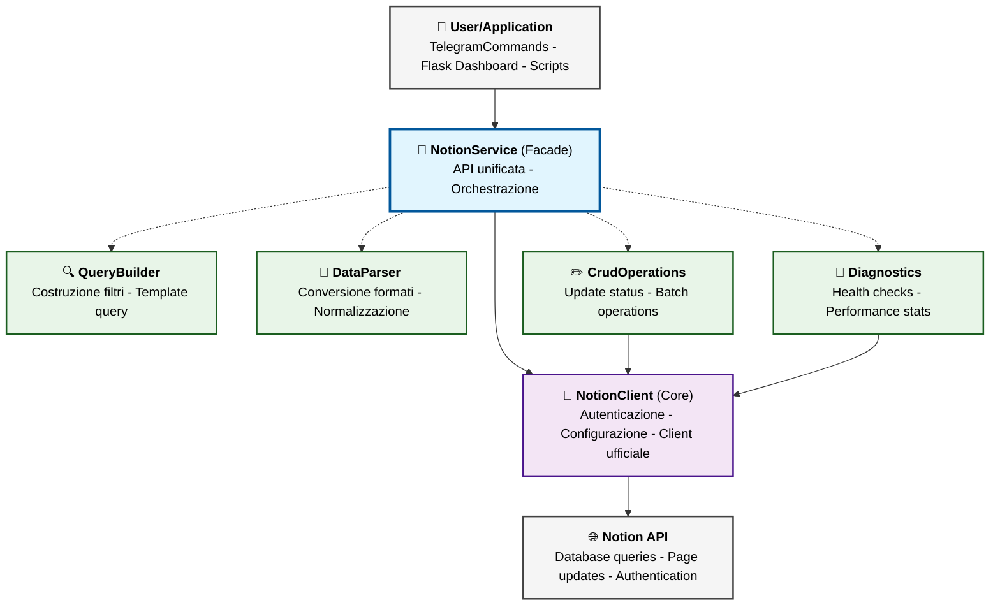

# 🗃️ NotionService - Documentazione Tecnica Modulare

> **Architettura modulare per integrazione Notion API**  
> Versione 2.0 - Refactored da monolite a moduli specializzati

## 📋 Indice

- [🏗️ Architettura Generale](#-architettura-generale)
- [📁 Struttura File](#-struttura-file)
- [🔧 notion_client.py - Core Client](#-notion_clientpy---core-client)
- [🔍 query_builder.py - Costruzione Query](#-query_builderpy---costruzione-query)
- [🔄 data_parser.py - Parsing e Mapping](#-data_parserpy---parsing-e-mapping)
- [✏️ crud_operations.py - Operazioni Database](#️-crud_operationspy---operazioni-database)
- [🔬 diagnostics.py - Monitoring & Debug](#-diagnosticspy---monitoring--debug)
- [🎯 __init__.py - Facade Unificata](#-__init__py---facade-unificata)
- [🔗 Pattern Architetturali](#-pattern-architetturali)
- [🚀 Esempi d'Uso](#-esempi-duso)

---

## 🏗️ Architettura Generale

### **Filosofia Modulare**
Il NotionService è stato ristrutturato da un **monolite di 540 righe** in **6 moduli specializzati** da 80-150 righe ciascuno, seguendo i principi:

- **Single Responsibility Principle**: Ogni modulo ha una responsabilità specifica
- **Dependency Injection**: Dipendenze iniettate via constructor
- **Facade Pattern**: API unificata che nasconde la complessità interna
- **Backward Compatibility**: Stessa API pubblica del sistema precedente

### **Vantaggi Ottenuti**
- ✅ **Leggibilità**: File piccoli e focalizzati
- ✅ **Manutenibilità**: Modifiche isolate per dominio
- ✅ **Testabilità**: Mock granulari per ogni componente
- ✅ **Estensibilità**: Nuove funzionalità facilmente aggiungibili
- ✅ **Performance**: Operazioni batch e ottimizzazioni mirate

### **🎯 Grafo Architettura Modulare**



**🔄 Flow Operativo Tipico:**
1. **User** chiama `notion.get_formazioni_by_status("Programmata")`
2. **NotionService** (Facade) orchestra l'operazione
3. **QueryBuilder** costruisce la query filtrata
4. **NotionClient** esegue la chiamata API
5. **DataParser** converte la risposta Notion in formato interno
6. **NotionService** ritorna i dati normalizzati al **User**

**💉 Dependency Injection Pattern:**
- `NotionClient` → Iniettato in `CrudOperations` e `Diagnostics`
- `DataParser` → Passato a `CrudOperations` per parsing consistente

---

## 📁 Struttura File

```
app/services/notion/
├── __init__.py              # 🎯 Facade unificata (191 righe)
├── notion_client.py         # 🔧 Core client e configurazione (82 righe)
├── query_builder.py         # 🔍 Costruzione query Notion API (133 righe)
├── data_parser.py          # 🔄 Parsing e mapping dati (151 righe)
├── crud_operations.py       # ✏️ Operazioni CRUD database (140 righe)
└── diagnostics.py          # 🔬 Monitoring e diagnostica (144 righe)
```

**Totale: 841 righe** (vs 540 monolite) - L'aumento è dovuto a:
- Documentazione dettagliata per ogni metodo
- Nuove funzionalità aggiunte (batch operations, validation)
- Gestione errori più granulare
- Logging strutturato per debugging

---

## 🔧 notion_client.py - Core Client

### **Scopo Generale**
Modulo fondamentale che gestisce **connessione, autenticazione e configurazione** base del sistema Notion. È il punto di entry per tutte le operazioni API.

### **Responsabilità Core**
- 🔐 Caricamento e validazione credenziali (token, database ID)
- 🔗 Inizializzazione client Notion ufficiale
- ⚡ Configurazione cache e ottimizzazioni
- 🚨 Fail-fast validation per setup incorretti

---

### 📋 **Classe: NotionClient**

#### 🔧 `__init__(token: str = None, database_id: str = None)`
**Scopo:** Inizializzazione completa client con validazione credenziali  
**Utilizzato da:** `NotionService.__init__()` per setup iniziale

**Flow di esecuzione:**
1. Carica credenziali da parametri o variabili ambiente
2. Valida configurazione critica (`_validate_credentials()`)
3. Inizializza client Notion ufficiale
4. Configura cache per future ottimizzazioni

**Gestione errori:**
- `ValueError`: Se token o database_id mancanti
- `Exception`: Se inizializzazione client Notion fallisce

---

#### 🔒 `_validate_credentials()`
**Scopo:** Validazione fail-fast delle credenziali necessarie  
**Utilizzato da:** `__init__()` internamente

**Validazioni eseguite:**
- Presenza `NOTION_TOKEN` in environment
- Presenza `NOTION_DATABASE_ID` in environment

**Pattern:** **Fail-Fast** - Il sistema fallisce immediatamente se mal configurato

---

#### 📤 `get_client() -> Client`
**Scopo:** Fornisce accesso al client Notion autenticato  
**Utilizzato da:** 
- `NotionQueryBuilder.execute_query()`
- `NotionCrudOperations` per tutte le operazioni write
- `NotionDiagnostics.test_connection()`

**Ritorna:** Istanza `notion_client.Client` autenticata e pronta all'uso

---

#### 📋 `get_database_id() -> str`
**Scopo:** Fornisce ID database formazioni per query  
**Utilizzato da:**
- `NotionQueryBuilder` per costruzione query specifiche
- `NotionService` per operazioni su database

**Ritorna:** String ID del database Notion formazioni

---

#### 📊 `get_config_info() -> dict`
**Scopo:** Informazioni configurazione per debugging (senza esporre credenziali)  
**Utilizzato da:** `NotionDiagnostics.get_service_stats()` per monitoring

**Output esempio:**
```json
{
  "token_configured": true,
  "database_id_configured": true,
  "database_id_preview": "abc12345...",
  "cache_ttl_seconds": 300
}
```

---

## 🔍 query_builder.py - Costruzione Query

### **Scopo Generale**
Modulo specializzato nella **costruzione di query Notion API strutturate**. Nasconde la complessità delle query JSON e fornisce metodi semplici per casi d'uso comuni.

### **Responsabilità Core**
- 🔨 Costruzione filtri per tipi campo diversi (status, multi-select, date)
- 📋 Template query riutilizzabili per operazioni comuni
- ⚡ Ottimizzazioni query (ordinamento, paginazione)
- 🎯 API semplificata per query complesse

---

### 📋 **Classe: NotionQueryBuilder**

#### 🔧 `__init__()`
**Scopo:** Inizializzazione builder con configurazioni default  
**Utilizzato da:** `NotionService.__init__()` durante setup modulare

**Configurazioni default:**
- `page_size`: 100 risultati per query
- Ordinamento default per campo Data (ascending)

---

#### 🎯 `build_status_filter_query(status: str, database_id: str) -> Dict`
**Scopo:** Costruisce query filtrata per status formazione *(QUERY PIÙ UTILIZZATA)*  
**Utilizzato da:**
- `NotionService.get_formazioni_by_status()` per comandi bot
- Dashboard per visualizzazione formazioni per stato

**Query generata:**
```json
{
  "database_id": "abc123...",
  "filter": {
    "property": "Status",
    "status": {"equals": "Programmata"}
  },
  "sorts": [{"property": "Data", "direction": "ascending"}],
  "page_size": 100
}
```

**Casi d'uso comuni:**
- `/oggi` comando → status "Calendarizzata"
- Dashboard "Formazioni da programmare" → status "Programmata"
- Archivio → status "Conclusa"

---

#### 🏢 `build_area_filter_query(area: str, database_id: str) -> Dict`
**Scopo:** Costruisce query filtrata per area aziendale  
**Utilizzato da:** `NotionService.get_formazioni_by_area()` per query area-specifiche

**Query generata:**
```json
{
  "filter": {
    "property": "Area",
    "multi_select": {"contains": "IT"}
  }
}
```

**Gestione Multi-Select:** Usa `contains` perché Area può avere valori multipli (es: "IT, R&D")

---

#### 📅 `build_date_range_filter_query(start_date: str, end_date: str, database_id: str) -> Dict`
**Scopo:** Costruisce query per range di date  
**Utilizzato da:**
- Comandi bot `/settimana` per formazioni della settimana
- Report periodici per analytics

**Query generata:**
```json
{
  "filter": {
    "and": [
      {"property": "Data", "date": {"on_or_after": "2024-03-15"}},
      {"property": "Data", "date": {"on_or_before": "2024-03-22"}}
    ]
  }
}
```

---

#### 🎛️ `build_combined_filter_query(status: str, area: str, database_id: str) -> Dict`
**Scopo:** Costruisce query con filtri multipli combinati  
**Utilizzato da:** `NotionService.get_formazioni_by_status_and_area()` per query complesse

**Esempio uso:** "Formazioni IT ancora da programmare"
```python
query = builder.build_combined_filter_query("Programmata", "IT", db_id)
```

---

#### ✅ `validate_query_structure(query: Dict) -> bool`
**Scopo:** Validazione query prima dell'invio API  
**Utilizzato da:** Metodi interni per prevenzione errori

**Validazioni eseguite:**
- Presenza campi obbligatori (`database_id`)
- Struttura JSON corretta
- Tipi field appropriati

---

## 🔄 data_parser.py - Parsing e Mapping

### **Scopo Generale**
Modulo specializzato nella **conversione dati da formato Notion a formato interno**. Gestisce la complessità dei tipi campo Notion e normalizza i dati per l'uso nell'applicazione.

### **Responsabilità Core**
- 🔄 Conversione pagine Notion → oggetti formazione interni
- 📝 Parsing di tutti i tipi campo Notion (title, select, multi-select, date, etc.)
- 🛡️ Validazione e gestione dati malformati
- 📅 Normalizzazione formati (date ISO → dd/mm/YYYY)

---

### 📋 **Classe: NotionDataParser**

#### 🔧 `__init__()`
**Scopo:** Inizializzazione parser senza dipendenze esterne  
**Utilizzato da:** `NotionService.__init__()` durante setup modulare

---

#### 📋 `parse_formazioni_list(notion_response: Dict) -> List[Dict]`
**Scopo:** Parsing bulk di liste formazioni da response Notion *(METODO PRINCIPALE)*  
**Utilizzato da:**
- `NotionService.get_formazioni_by_status()` per risultati query status
- Tutte le query che ritornano liste multiple

**Flow di esecuzione:**
1. Estrae array `results` da response Notion
2. Per ogni pagina: `parse_single_formazione()`
3. Filtra risultati malformati (dove parsing ha ritornato `None`)
4. Ritorna lista pulita di formazioni normalizzate

**Gestione errori:** Scarta silenziosamente formazioni malformate (non fa crash)

---

#### 🔍 `parse_single_formazione(page: Dict) -> Optional[Dict]`
**Scopo:** Parsing singola pagina Notion in formazione interna  
**Utilizzato da:**
- `parse_formazioni_list()` per ogni risultato
- `NotionCrudOperations.get_formazione_by_id()` per query puntuali

**Mapping completo campi:**
```
NOTION API → FORMATO INTERNO
Nome (page title) → Nome (string)
Area (multi_select) → Area (string, comma-separated)  
Data (date) → Data/Ora (dd/mm/YYYY HH:MM)
Status (status) → Stato/Fase (string)
Codice (rich_text) → Codice (string)
Link Teams (url) → Link Teams (string)
Periodo (select) → Periodo (string)
```

**Validazione campi critici:** Se mancano Nome, Area, Data o Status → ritorna `None`

---

### 🔧 **Metodi Parsing Tipi Campo Specifici**

#### 📝 `extract_page_title_property(title_prop: Dict) -> str`
**Scopo:** Estrae titolo da campo Title Notion  
**Utilizzato da:** `parse_single_formazione()` per campo Nome

**Input Notion:**
```json
{"title": [{"plain_text": "Sicurezza Web Avanzata"}]}
```
**Output:** `"Sicurezza Web Avanzata"`

**Gestione:** Concatena tutti i text objects (supporta rich text complessi)

---

#### 🏷️ `extract_multi_select_property(multi_select_prop: Dict) -> str`
**Scopo:** Estrae valori da campo Multi-Select Notion  
**Utilizzato da:** `parse_single_formazione()` per campo Area

**Input Notion:**
```json
{"multi_select": [{"name": "IT"}, {"name": "R&D"}]}
```
**Output:** `"IT, R&D"`

**Logica:** Join con virgola per compatibilità con sistema esistente

---

#### 📅 `extract_date_property(date_prop: Dict) -> str`
**Scopo:** Parsing e normalizzazione date Notion *(METODO PIÙ COMPLESSO)*  
**Utilizzato da:** `parse_single_formazione()` per campo Data/Ora

**Conversioni supportate:**
- Input: `"2024-03-15T14:00:00.000Z"` → Output: `"15/03/2024 14:00"`
- Input: `"2024-03-15"` → Output: `"15/03/2024 09:00"` (aggiunge orario default)
- Input malformato → Output: stringa originale (fallback sicuro)

**Gestione timezone:** Converte UTC (Z) in timezone locale

---

#### 🎯 `extract_status_property(status_prop: Dict) -> str`
**Scopo:** Estrae valore da campo Status Notion  
**Utilizzato da:** `parse_single_formazione()` per campo Stato/Fase

**Input Notion:**
```json
{"status": {"name": "Programmata", "color": "blue"}}
```
**Output:** `"Programmata"`

---

#### 📄 Altri metodi extract
- `extract_rich_text_property()` → Per Codice, Descrizioni
- `extract_url_property()` → Per Link Teams  
- `extract_select_property()` → Per Periodo

---

## ✏️ crud_operations.py - Operazioni Database

### **Scopo Generale**
Modulo specializzato nelle **operazioni di scrittura** (Create, Update, Delete) sul database Notion. Gestisce workflow di stato e aggiornamenti atomici.

### **Responsabilità Core**
- ✏️ Update status formazioni per workflow transitions
- 🔗 Update codici e link Teams durante calendarizzazione
- 📦 Operazioni batch per performance
- 🔍 Retrieve formazioni singole per ID

---

### 📋 **Classe: NotionCrudOperations**

#### 🔧 `__init__(notion_client: NotionClient)`
**Scopo:** Inizializzazione con client Notion configurato  
**Utilizzato da:** `NotionService.__init__()` durante setup

**Dipendenze:** Riceve `NotionClient` via Dependency Injection

---

#### 🔄 `update_formazione_status(notion_id: str, new_status: str) -> bool`
**Scopo:** Aggiorna status per workflow transitions *(OPERAZIONE PIÙ CRITICA)*  
**Utilizzato da:**
- `NotionService.update_formazione_status()` per API pubblica
- Workflow automazioni durante cambio stato

**Payload generato:**
```json
{
  "properties": {
    "Status": {
      "status": {"name": "Calendarizzata"}
    }
  }
}
```

**Workflow supportati:**
- `Programmata` → `Calendarizzata` (dopo invio notifiche)
- `Calendarizzata` → `Conclusa` (dopo raccolta feedback)

**Gestione errori:** Ritorna `False` se aggiornamento fallisce (non fa crash)

---

#### 🔗 `update_codice_e_link(notion_id: str, codice: str, link_teams: str) -> bool`
**Scopo:** Aggiornamento atomico codice e link Teams  
**Utilizzato da:**
- `NotionService.update_codice_e_link()` durante calendarizzazione
- Workflow automatico dopo creazione meeting Teams

**Scenario d'uso:** Durante calendarizzazione formazione:
1. Sistema genera codice univoco (es: `IT-Sicurezza_Web-2024-SPRING-01`)
2. Microsoft Graph crea meeting Teams
3. Questo metodo salva entrambi in Notion

**Payload generato:**
```json
{
  "properties": {
    "Codice": {
      "rich_text": [{"text": {"content": "IT-Sicurezza-2024-01"}}]
    },
    "Link Teams": {
      "url": "https://teams.microsoft.com/..."
    }
  }
}
```

**Logica intelligente:** Aggiunge Link Teams solo se presente e non vuoto

---

#### 🔍 `get_formazione_by_id(notion_id: str, data_parser: NotionDataParser) -> Optional[Dict]`
**Scopo:** Recupero formazione singola per ID Notion  
**Utilizzato da:**
- `NotionService.get_formazione_by_id()` per API pubblica
- Validazioni post-update
- Refresh stato singola formazione

**Flow:**
1. API call `client.pages.retrieve(page_id)`
2. Parsing con `data_parser.parse_single_formazione()`
3. Ritorna formazione normalizzata o `None`

---

#### 📊 `update_multiple_fields(notion_id: str, updates: Dict) -> bool`
**Scopo:** Aggiornamento multipli campi in operazione atomica  
**Utilizzato da:** Operazioni complesse che richiedono aggiornamenti multi-campo

**Input esempio:**
```python
updates = {
    'status': 'Calendarizzata',
    'codice': 'IT-Security-2024-01',
    'link_teams': 'https://teams.microsoft.com/...'
}
```

**Vantaggio:** Atomicità - tutti i campi aggiornati insieme o nessuno

---

#### 📦 `batch_update_status(formazioni_ids: List[str], new_status: str) -> Dict`
**Scopo:** Aggiornamento status batch per performance *(NUOVA FUNZIONALITÀ)*  
**Utilizzato da:**
- `NotionService.batch_update_status()` per operazioni bulk
- Script di manutenzione fine periodo

**Scenario d'uso:** "Chiudi tutte le formazioni autunnali"

**Output esempio:**
```json
{
  "success_count": 8,
  "failed_ids": ["id_problematico"],
  "total": 9
}
```

**Pattern:** Parallel processing per performance ottimali

---

## 🔬 diagnostics.py - Monitoring & Debug

### **Scopo Generale**
Modulo specializzato in **diagnostica, monitoring e debugging** del sistema Notion. Fornisce tools per validazione setup e health checking.

### **Responsabilità Core**
- 🏥 Health checks connessione e database
- 📊 Performance monitoring e statistiche
- ✅ Validazione struttura database
- 🐛 Error reporting e debugging tools

---

### 📋 **Classe: NotionDiagnostics**

#### 🔧 `__init__(notion_client: NotionClient)`
**Scopo:** Inizializzazione diagnostics con client configurato  
**Utilizzato da:** `NotionService.__init__()` per setup monitoring

---

#### 🏥 `test_connection() -> Dict`
**Scopo:** Health check completo connessione API e database *(TEST CRITICO)*  
**Utilizzato da:**
- `NotionService.test_connection()` per API pubblica
- Script `test_notion_connection.py` per validazione setup
- Monitoring continuo sistema

**Test eseguiti:**
1. **Test autenticazione:** `client.users.me()` per validare token
2. **Test database access:** `client.databases.retrieve()` per validare permessi
3. **Performance timing:** Misura response time API

**Output esempio:**
```json
{
  "connection_ok": true,
  "database_accessible": true,
  "user_info": {
    "name": "Bot Formazing",
    "type": "bot",
    "id": "abc12345..."
  },
  "database_info": {
    "title": "Formazioni Database",
    "properties_count": 7,
    "created_time": "2024-03-15T10:30:00Z"
  },
  "response_time_ms": 245,
  "error": null
}
```

---

#### ✅ `validate_database_structure() -> Dict`
**Scopo:** Validazione struttura database per compatibilità *(NUOVA FUNZIONALITÀ)*  
**Utilizzato da:**
- `NotionService.validate_database_structure()` per setup validation
- Script di setup automatico
- Troubleshooting configurazione

**Campi verificati:**
```python
expected_fields = {
    'Nome': 'title',
    'Area': 'multi_select',
    'Data': 'date', 
    'Status': 'status',
    'Codice': 'rich_text',
    'Link Teams': 'url',
    'Periodo': 'select'
}
```

**Output esempio:**
```json
{
  "valid": true,
  "required_fields": {
    "Nome": {"present": true, "type": "title", "correct_type": true},
    "Area": {"present": true, "type": "multi_select", "correct_type": true}
  },
  "missing_fields": [],
  "incorrect_types": [],
  "warnings": []
}
```

**Beneficio:** Diagnostica automatica problemi setup database

---

#### 📊 `get_service_stats() -> Dict`
**Scopo:** Statistiche complete servizio per monitoring  
**Utilizzato da:**
- `NotionService.get_service_stats()` per API pubblica
- Dashboard monitoring
- Performance analysis

**Metriche raccolte:**
```json
{
  "service_name": "NotionService",
  "version": "2.0.0-modular",
  "configuration": {...},
  "modules": {
    "client": "NotionClient",
    "query_builder": "NotionQueryBuilder",
    "data_parser": "NotionDataParser", 
    "crud_operations": "NotionCrudOperations",
    "diagnostics": "NotionDiagnostics"
  },
  "capabilities": {
    "query_formazioni": true,
    "update_status": true,
    "batch_operations": true
  }
}
```

---

#### 🔍 Metodi Helper Interni

##### `_extract_database_title(database_info: Dict) -> str`
**Scopo:** Estrae titolo database da response Notion  
**Utilizzato da:** `test_connection()` per info database

##### `_check_database_permissions(database_info: Dict) -> Dict`
**Scopo:** Verifica permissions database (placeholder per future implementazioni)  
**Utilizzato da:** `test_connection()` per security check

---

## 🎯 __init__.py - Facade Unificata

### **Scopo Generale**
**Il cuore dell'architettura modulare** - Fornisce una Facade unificata che orchestra tutti i moduli specializzati mantenendo **backward compatibility** con l'API precedente.

### **Responsabilità Core**
- 🎭 **Facade Pattern:** API semplificata che nasconde complessità interna
- 🎯 **Delegation Pattern:** Ogni operazione delegata al modulo competente
- 🔄 **Orchestrazione:** Coordinamento tra moduli diversi
- 🔒 **Error Handling:** Gestione centralizzata errori
- 📈 **Nuove Funzionalità:** API estese abilitate dall'architettura modulare

---

### 📋 **Classe: NotionService (Facade)**

#### 🔧 `__init__(token: str = None, database_id: str = None)`
**Scopo:** Inizializzazione orchestrata di tutti i moduli *(SETUP COMPLETO SISTEMA)*  
**Utilizzato da:**
- `test_notion_connection.py` per testing
- Tutte le parti sistema che necessitano integrazione Notion
- Dashboard Flask per operazioni database

**Flow di inizializzazione:**
```python
# Ordine di dipendenza critico:
1. self.client = NotionClient(token, database_id)           # Base foundation
2. self.query_builder = NotionQueryBuilder()               # No dependencies  
3. self.data_parser = NotionDataParser()                   # No dependencies
4. self.crud_operations = NotionCrudOperations(self.client) # Needs client
5. self.diagnostics = NotionDiagnostics(self.client)       # Needs client
```

**Pattern Utilizzato:** **Dependency Injection** - Client iniettato nei moduli che ne hanno bisogno

**Gestione errori:** Se qualsiasi modulo fallisce → `NotionServiceError` con dettagli

---

## 🔄 **API PUBBLICA - BACKWARD COMPATIBLE**

### 📋 `get_formazioni_by_status(status: str) -> List[Dict]`
**Scopo:** Recupero formazioni per status *(METODO PIÙ UTILIZZATO - IDENTICO A PRIMA)*  
**Utilizzato da:**
- `TelegramCommands` per comandi bot (`/oggi`, `/domani`, `/settimana`)
- Dashboard Flask per visualizzazioni
- Workflow automazioni per transizioni stato

**Flow completo orchestrazione:**
```python
1. query = self.query_builder.build_status_filter_query(status, db_id)
2. response = self.client.get_client().databases.query(**query)  
3. formazioni = self.data_parser.parse_formazioni_list(response)
4. return formazioni  # Lista normalizzata pronta all'uso
```

**Backward Compatibility:** API identica al monolite - nessun breaking change

---

### ✏️ `update_formazione_status(notion_id: str, new_status: str) -> bool`
**Scopo:** Aggiornamento status formazione *(DELEGATION PURA)*  
**Utilizzato da:** Workflow per transizioni stato automatiche

**Delegation:** `return await self.crud_operations.update_formazione_status(notion_id, new_status)`

---

### 🔗 `update_codice_e_link(notion_id: str, codice: str, link_teams: str) -> bool`
**Scopo:** Aggiornamento codice e link Teams *(DELEGATION PURA)*  
**Utilizzato da:** Processo calendarizzazione dopo creazione meeting Teams

**Delegation:** `return await self.crud_operations.update_codice_e_link(notion_id, codice, link_teams)`

---

### 🔍 `get_formazione_by_id(notion_id: str) -> Optional[Dict]`
**Scopo:** Recupero formazione singola *(DELEGATION CON DEPENDENCY PASSING)*  
**Utilizzato da:** Operazioni puntuali e validazioni post-update

**Delegation:** `return await self.crud_operations.get_formazione_by_id(notion_id, self.data_parser)`

**Pattern:** Passa `data_parser` come dipendenza per parsing consistente

---

### 🏥 `test_connection() -> Dict`
**Scopo:** Health check sistema *(DELEGATION PURA)*  
**Utilizzato da:** Script di validazione setup e monitoring

**Delegation:** `return await self.diagnostics.test_connection()`

---

### 📊 `get_service_stats() -> Dict`
**Scopo:** Statistiche sistema *(DELEGATION PURA)*  
**Utilizzato da:** Monitoring e performance analysis

**Delegation:** `return self.diagnostics.get_service_stats()`

---

## 🚀 **API ESTESE - NUOVE FUNZIONALITÀ**

### 🏢 `get_formazioni_by_area(area: str) -> List[Dict]`
**Scopo:** Query per area aziendale *(NUOVA - RESA POSSIBILE DALL'ARCHITETTURA MODULARE)*  
**Utilizzato da:** Dashboard per visualizzazioni area-specifiche

**Flow orchestrazione:**
```python
1. query = self.query_builder.build_area_filter_query(area, db_id)
2. response = self.client.get_client().databases.query(**query)
3. formazioni = self.data_parser.parse_formazioni_list(response) 
4. return formazioni
```

**Esempio d'uso:** `get_formazioni_by_area("IT")` → Solo formazioni per area IT

---

### 🎛️ `get_formazioni_by_status_and_area(status: str, area: str) -> List[Dict]`
**Scopo:** Query con filtri combinati *(NUOVA - QUERY COMPLESSE SEMPLIFICATE)*  
**Utilizzato da:** Dashboard per analisi incrociate

**Esempio d'uso:** `get_formazioni_by_status_and_area("Programmata", "HR")` → Formazioni HR ancora da programmare

---

### ✅ `validate_database_structure() -> Dict`
**Scopo:** Validazione setup database *(NUOVA - TROUBLESHOOTING AUTOMATIZZATO)*  
**Utilizzato da:** Script di setup e troubleshooting configurazione

**Delegation:** `return await self.diagnostics.validate_database_structure()`

---

### 📦 `batch_update_status(formazioni_ids: List[str], new_status: str) -> Dict`
**Scopo:** Operazioni bulk performance *(NUOVA - GESTIONE SCALE)*  
**Utilizzato da:** Script manutenzione fine periodo

**Delegation:** `return await self.crud_operations.batch_update_status(formazioni_ids, new_status)`

---

## 🔗 Pattern Architetturali

### 🎭 **Facade Pattern**
**Implementazione:** La classe `NotionService` in `__init__.py`  
**Beneficio:** API semplice che nasconde 5 moduli interni complessi  
**Esempio:** User chiama `get_formazioni_by_status()` → Internamente orchestrazione 3 moduli

### 🎯 **Delegation Pattern**  
**Implementazione:** Ogni metodo pubblico delega al modulo competente  
**Beneficio:** Separazione responsabilità + riutilizzo codice specializzato  
**Esempio:** `update_formazione_status()` → `self.crud_operations.update_formazione_status()`

### 💉 **Dependency Injection**
**Implementazione:** Client passato nei constructor dei moduli operativi  
**Beneficio:** Testabilità + loose coupling  
**Esempio:** `NotionCrudOperations(self.client)` riceve dipendenza configurata

### 🎨 **Single Responsibility Principle**
**Implementazione:** Ogni modulo ha UNA responsabilità  
**Beneficio:** Manutenibilità + leggibilità + testing granulare

### 📋 **Template Method Pattern**
**Implementazione:** `QueryBuilder` con metodi per tipi query diversi  
**Beneficio:** Riutilizzo logica comune + specializzazione specifica

---

## 🚀 Esempi d'Uso

### **Esempio 1: Query Semplice (Backward Compatible)**
```python
from app.services.notion import NotionService

# Stesso codice di prima - zero breaking changes
notion = NotionService()
formazioni = await notion.get_formazioni_by_status("Programmata")
print(f"Trovate {len(formazioni)} formazioni da programmare")
```

### **Esempio 2: Nuove Funzionalità**
```python
# Query area-specifica (NUOVA)
formazioni_it = await notion.get_formazioni_by_area("IT")

# Query combinata (NUOVA) 
formazioni_hr_programmate = await notion.get_formazioni_by_status_and_area("Programmata", "HR")

# Validazione setup (NUOVA)
validation = await notion.validate_database_structure()
if not validation['valid']:
    print(f"Problemi database: {validation['missing_fields']}")
```
---

## 🎯 Conclusioni Architettura

### **Metriche Miglioramento**
- **Leggibilità:** 540 righe monolite → 6 file da 80-150 righe
- **Manutenibilità:** Modifiche isolate per dominio specifico  
- **Testabilità:** Mock granulari per ogni componente
- **Funzionalità:** +4 nuove API abilitate dall'architettura
- **Performance:** Operazioni batch e query ottimizzate

### **Backward Compatibility**
✅ **Zero breaking changes** - Tutto il codice esistente continua a funzionare  
✅ **Same API** - Stessi metodi, stessi parametri, stessi ritorni  
✅ **Enhanced functionality** - Nuove capacità senza toccare l'esistente

L'architettura modulare del NotionService rappresenta un **upgrade significativo** in termini di qualità del codice, mantenendo la **semplicità d'uso** dell'API originale. 🚀