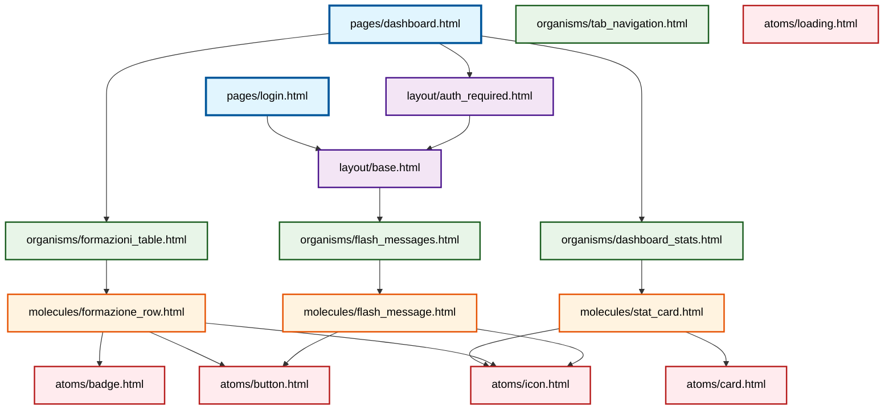

# 📚 Template System - Documentazione Generale

Benvenuto nella documentazione completa del **Sistema di Template Atomico** di Formazing. Questo sistema implementa il pattern **Atomic Design** per creare un'interfaccia utente modulare, riutilizzabile e facilmente manutenibile.

## 🎯 Panoramica del Sistema

Il sistema di template di Formazing è basato su **Atomic Design**, una metodologia che organizza i componenti UI in 5 livelli gerarchici:

```
Pages (Esperienze utente complete)
    ↓
Layouts (Strutture di pagina)
    ↓  
Organisms (Sezioni funzionali)
    ↓
Molecules (Componenti intelligenti)
    ↓
Atoms (Elementi base)
```

### 🏗️ Struttura Directory

```
app/templates/
├── atoms/                 # 6 componenti base
│   ├── badge.html
│   ├── button.html
│   ├── card.html
│   ├── icon.html
│   ├── loading.html
│   └── telegram_message_preview.html
├── molecules/             # 7 componenti intelligenti
│   ├── flash_message.html
│   ├── formazione_row.html
│   ├── stat_card.html
│   ├── preview_action_form.html
│   ├── preview_email_section.html
│   ├── preview_telegram_messages.html
│   └── preview_training_info.html
├── organisms/             # 4 sezioni complete
│   ├── dashboard_stats.html
│   ├── flash_messages.html
│   ├── formazioni_table.html
│   └── tab_navigation.html
├── layout/                # 2 strutture base
│   ├── base.html
│   └── auth_required.html
├── pages/                 # 3 pagine complete
│   ├── dashboard.html
│   ├── login.html
│   └── preview.html
└── legacy/                # Template obsoleti
```

**Totale: 22 componenti attivi** + template legacy archiviati

---

## 📖 Documentazione Disponibile

### 1. **[Atoms](atoms.md)** - Componenti Base
Documentazione dei mattoni fondamentali del sistema:
- **6 atoms**: button, badge, card, icon, loading, telegram_message_preview
- **Props configurabili**: Per personalizzazione completa
- **Esempi d'uso**: Codice pratico per ogni atom
- **Best practices**: Come e quando usare ciascun componente

### 2. **[Molecules](molecules.md)** - Componenti Intelligenti  
Documentazione dei componenti con logica di business:
- **7 molecules**: stat_card, formazione_row, flash_message + 4 preview molecules
- **Logica integrata**: Auto-colorazione, formattazione, comportamenti
- **Mappature automatiche**: Colori per status, aree, periodi
- **Integrazione Flask**: Flash messages e oggetti Notion

### 3. **[Organisms](organisms.md)** - Sezioni Complete
Documentazione delle sezioni funzionali complete:
- **4 organisms**: dashboard_stats, tab_navigation, formazioni_table, flash_messages
- **JavaScript integrato**: Auto-refresh, tab switching, interattività
- **Stati avanzati**: Loading, errori, empty states
- **Responsive design**: Comportamenti mobile e desktop

### 4. **[Layouts](layouts.md)** - Strutture di Pagina
Documentazione delle strutture HTML fondamentali:
- **2 layouts**: base.html, auth_required.html
- **Blocchi Jinja2**: head, content, scripts
- **Risorse condivise**: Bootstrap, CSS, JavaScript
- **Ereditarietà**: Sistema gerarchico di template

### 5. **[Pages](pages.md)** - Pagine Complete
Documentazione delle esperienze utente finali:
- **3 pages**: login.html, dashboard.html, preview.html
- **Composizione finale**: Orchestrazione di tutti i componenti
- **User flows**: Flussi di navigazione e interazione
- **Business logic**: Integrazione con backend Flask

### 6. **[Dependency Graph](dependency_graph.md)** - Grafo delle Dipendenze
Analisi completa delle relazioni tra componenti:
- **Grafo visuale**: Diagramma Mermaid interattivo
- **Statistiche utilizzo**: Componenti più/meno utilizzati
- **Percorsi critici**: Catene di dipendenze complete
- **Impatti modifiche**: Analisi dei rischi per manutenzione

---

## 🔗 Mappa delle Dipendenze

### 🌐 Grafo Completo delle Dipendenze



### 🎯 Analisi del Grafo

**Componenti più utilizzati** (per numero di dipendenze):
1. **atoms/icon.html** → Usato da 3 molecules (più riutilizzato)
2. **atoms/button.html** → Usato da 2 molecules
3. **layout/base.html** → Base per tutti i layout

**Percorsi critici**:
- `dashboard.html → auth_required.html → base.html → flash_messages.html → flash_message.html → [icon, button]`
- `dashboard.html → dashboard_stats.html → stat_card.html → [icon, card]`
- `dashboard.html → formazioni_table.html → formazione_row.html → [badge, button, icon]`

### Chi Usa Cosa

#### **📄 Pages → Layouts**
```
pages/login.html → layout/base.html
pages/dashboard.html → layout/auth_required.html → layout/base.html
```

#### **📄 Pages → Organisms**
```
pages/dashboard.html → organisms/dashboard_stats.html
                    → organisms/formazioni_table.html
                    
layout/base.html → organisms/flash_messages.html
```

#### **🦠 Organisms → Molecules**
```
organisms/dashboard_stats.html → molecules/stat_card.html
organisms/formazioni_table.html → molecules/formazione_row.html
organisms/flash_messages.html → molecules/flash_message.html
```

#### **🧬 Molecules → Atoms**
```
molecules/stat_card.html → atoms/icon.html + atoms/card.html
molecules/formazione_row.html → atoms/badge.html + atoms/button.html + atoms/icon.html
molecules/flash_message.html → atoms/icon.html + atoms/button.html
```

#### **⚛️ Atoms → Standalone**
```
atoms/button.html (componente autonomo)
atoms/badge.html (componente autonomo)  
atoms/card.html (componente autonomo)
atoms/icon.html (componente autonomo)
atoms/loading.html (componente autonomo)
```

---

## 🚀 Flusso di Sviluppo

### Per Aggiungere Nuove Funzionalità

1. **Nuovi Elementi Base** → Crea atoms
2. **Combinazioni Logiche** → Crea molecules  
3. **Sezioni Complete** → Crea organisms
4. **Nuove Strutture** → Estendi layouts
5. **Nuove Esperienze** → Componi pages

### Per Modificare Esistenti

1. **Trova il livello appropriato** nella gerarchia
2. **Modifica il componente** più specifico possibile
3. **Verifica le dipendenze** verso l'alto
4. **Testa tutte le pages** che usano il componente

---

## 🔧 Strumenti e Tecnologie

### **Frontend Stack**
- **Template Engine**: Jinja2 (Flask)
- **CSS Framework**: Bootstrap 5.3.0
- **Icons**: Bootstrap Icons 1.10.0
- **JavaScript**: Bootstrap JS + Custom scripts

### **Metodologia**
- **Atomic Design**: Brad Frost methodology
- **Component Props**: Jinja2 `` variables
- **Template Inheritance**: `` + ``
- **Component Inclusion**: `` pattern

---

## 📈 Statistiche Sistema

```
Componenti Totali: 22
├── Atoms: 6 (27%)
├── Molecules: 7 (32%)  
├── Organisms: 4 (18%)
├── Layouts: 2 (9%)
└── Pages: 3 (14%)

File Documentazione: 7
├── README.md (panoramica generale)
├── atoms.md (6 componenti base)
├── molecules.md (7 componenti intelligenti)
├── organisms.md (4 sezioni complete)
├── layouts.md (2 strutture)
├── pages.md (3 pagine)
└── dependency_graph.md (analisi dipendenze)

Linee di Codice Template: ~1,800
Dipendenze Esterne: 2 (Bootstrap CSS + Icons)
Compatibilità Browser: Modern browsers (ES6+)
Responsive Breakpoints: 4 (xs, sm, md, lg, xl)
Profondità Massima Dipendenze: 5 livelli
Componente più utilizzato: atoms/icon.html (3+ dipendenze)
Nuovi componenti (v2.0): 6 (telegram_message_preview + 4 preview molecules + preview page)
```

---

## 📞 Supporto e Riferimenti

- **Atomic Design Methodology**: [atomicdesign.bradfrost.com](https://atomicdesign.bradfrost.com)
- **Jinja2 Documentation**: [jinja.palletsprojects.com](https://jinja.palletsprojects.com)
- **Bootstrap Documentation**: [getbootstrap.com](https://getbootstrap.com)
- **Bootstrap Icons**: [icons.getbootstrap.com](https://icons.getbootstrap.com)

---

**Il sistema di template Formazing è pronto per scalare e crescere con il progetto!** 🎨✨