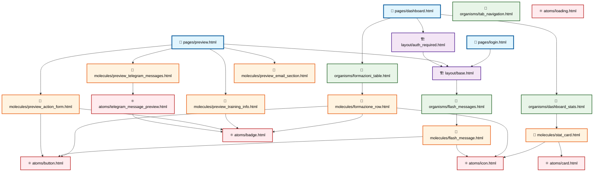
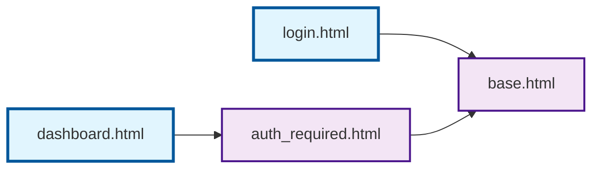
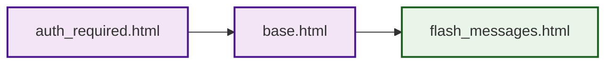
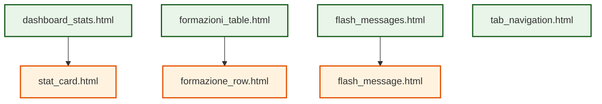
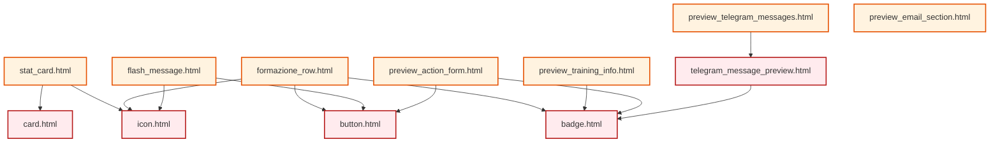
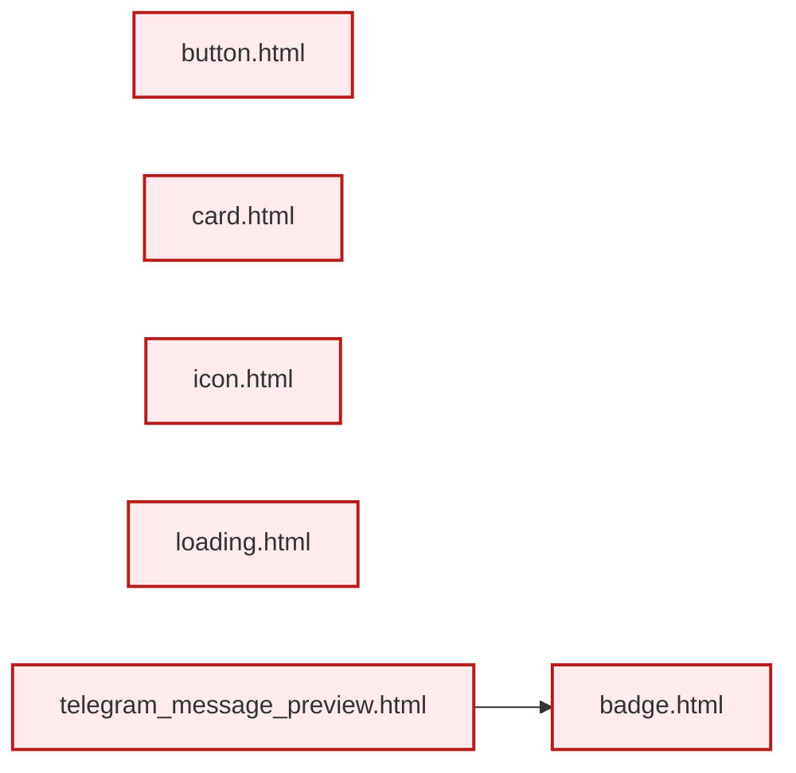

# 🕸️ Dependency Graph - Sistema Template Formazing

Analisi completa delle dipendenze tra i componenti del sistema di template atomico.

---

## 🌐 Grafo Completo delle Dipendenze

---

## 📊 Analisi per Livello

### 📄 Pages (Livello 5)

**Dipendenze:**
- `login.html` → `base.html` (direct)
- `dashboard.html` → `auth_required.html` → `base.html` (chain)
- `preview.html` → `base.html` (direct) + 4 preview molecules

### 🏗️ Layouts (Livello 4)

**Dipendenze:**
- `auth_required.html` → `base.html` (inheritance)
- `base.html` → `flash_messages.html` (include)

### 🦠 Organisms (Livello 3)

**Dipendenze:**
- `dashboard_stats.html` → `stat_card.html`
- `formazioni_table.html` → `formazione_row.html`
- `flash_messages.html` → `flash_message.html`
- `tab_navigation.html` → standalone (usa solo Bootstrap)

### 🧬 Molecules (Livello 2)

**Dipendenze:**
- `stat_card.html` → `icon.html` + `card.html`
- `formazione_row.html` → `badge.html` + `button.html` + `icon.html`
- `flash_message.html` → `icon.html` + `button.html`
- `preview_training_info.html` → `badge.html` (per Area e Stato)
- `preview_telegram_messages.html` → `telegram_message_preview.html`
- `preview_email_section.html` → standalone (nessuna dipendenza atom)
- `preview_action_form.html` → `badge.html` + `button.html`

### ⚛️ Atoms (Livello 1)

**Quasi tutti gli atoms sono componenti autonomi, tranne:**
- `telegram_message_preview.html` → dipende da `badge.html`

---

## 📈 Statistiche di Utilizzo

### Componenti più utilizzati (Incoming Dependencies)

| Componente | Utilizzato da | Frequenza |
|------------|---------------|-----------|
| `atoms/badge.html` | 4 molecules | 🔥🔥🔥🔥 |
| `atoms/button.html` | 3 molecules | 🔥🔥🔥 |
| `atoms/icon.html` | 3 molecules | 🔥🔥🔥 |
| `layout/base.html` | 3 pages | 🔥🔥🔥 |
| `atoms/card.html` | 1 molecule | 🔥 |
| `atoms/telegram_message_preview.html` | 1 molecule | 🔥 |
| `atoms/loading.html` | 0 componenti | ⚠️ |

### Componenti più dipendenti (Outgoing Dependencies)

| Componente | Dipende da | Complessità |
|------------|------------|-------------|
| `molecules/formazione_row.html` | 3 atoms | 🔥🔥🔥 |
| `pages/preview.html` | 4 molecules | 🔥🔥🔥🔥 |
| `molecules/preview_action_form.html` | 2 atoms | 🔥🔥 |
| `molecules/stat_card.html` | 2 atoms | 🔥🔥 |
| `molecules/flash_message.html` | 2 atoms | 🔥🔥 |
| `molecules/preview_training_info.html` | 1 atom | 🔥 |
| `molecules/preview_telegram_messages.html` | 1 atom | 🔥 |

---

## 🔄 Impatti delle Modifiche

### Se modifichi un Atom
**Effetto a cascata verso l'alto:**

- `atoms/badge.html` → Impatta **5 componenti** (4 molecules + telegram_message_preview) + **2 pages**
- `atoms/button.html` → Impatta **3 molecules** + **3 organisms** + **2 pages**
- `atoms/icon.html` → Impatta **3 molecules** + **4 organisms** + **2 pages**
- `atoms/telegram_message_preview.html` → Impatta **1 molecule** + **1 page**
- `atoms/card.html` → Impatta **1 molecule** + **1 organism** + **1 page**
- `atoms/loading.html` → **Nessun impatto** (non utilizzato)

### Se modifichi una Molecule
**Effetto limitato:**

- `molecules/stat_card.html` → Impatta **1 organism** + **1 page**
- `molecules/formazione_row.html` → Impatta **1 organism** + **1 page**
- `molecules/flash_message.html` → Impatta **1 organism** + **2 pages**
- `molecules/preview_training_info.html` → Impatta **1 page** (preview)
- `molecules/preview_telegram_messages.html` → Impatta **1 page** (preview)
- `molecules/preview_email_section.html` → Impatta **1 page** (preview)
- `molecules/preview_action_form.html` → Impatta **1 page** (preview)

### Se modifichi un Organism
**Effetto minimo:**

- Ogni organism impatta al massimo **1-2 pages**

---

## 🚨 Componenti a Rischio

### ⚠️ Atom Badge (Alto Rischio) - **NUOVO LEADER**
- **Utilizzato da:** 4 molecules + 1 atom
- **Impatto modifiche:** Molto alto
- **Raccomandazione:** Modifiche conservative, testing estensivo su tutte le preview

### ⚠️ Atom Icon (Alto Rischio)
- **Utilizzato da:** 3 molecules
- **Impatto modifiche:** Alto
- **Raccomandazione:** Modifiche conservative, testing estensivo

### ⚠️ Atom Button (Alto Rischio)
- **Utilizzato da:** 3 molecules
- **Impatto modifiche:** Alto
- **Raccomandazione:** Testing su formazione_row, flash_message e preview_action_form

### ⚠️ Layout Base (Alto Rischio)  
- **Utilizzato da:** Tutte le 3 pages
- **Impatto modifiche:** Critico
- **Raccomandazione:** Solo modifiche essenziali

### ⚠️ Preview Page (Dipendenze Multiple)
- **Dipende da:** 4 molecules preview
- **Complessità:** Alta
- **Raccomandazione:** Testing completo user flow notifiche/feedback

### ✅ Loading Atom (Rischio Zero)
- **Utilizzato da:** Nessuno
- **Stato:** Candidato per rimozione o integrazione futura

---

**Il grafo delle dipendenze ti aiuta a navigare e modificare il sistema in sicurezza!** 🎯✨