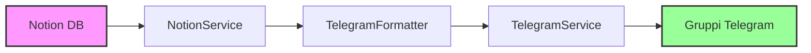

# Test di Integrazione End-to-End Notion ↔ Telegram

> **Documentazione completa del sistema di test E2E per l'integrazione Notion-Telegram di Formazing**

## 📋 Indice

- [Panoramica](#-panoramica)
- [Architettura dei Test](#-architettura-dei-test)
- [Test Files Overview](#-test-files-overview)
- [Analisi Dettagliata dei Test](#-analisi-dettagliata-dei-test)
  - [test_real_config.py](#test_real_configpy---verifica-configurazione)
  - [test_real_formatting.py](#test_real_formattingpy---test-formattazione)
  - [test_real_send.py](#test_real_sendpy---invio-controllato)
  - [test_workflow.py](#test_workflowpy---workflow-completo)
- [Guida Utilizzo](#-guida-utilizzo)
- [Troubleshooting](#-troubleshooting)

---

## 🎯 Panoramica

I test E2E (End-to-End) di Formazing verificano l'intera pipeline di integrazione tra **Notion** (database formazioni) e **Telegram** (sistema di notifiche). Questi test sono progettati per garantire che l'intero workflow aziendale funzioni correttamente in condizioni reali.

### Workflow Aziendale Testato



**Pipeline completa**: Formazioni create in Notion → Recupero dati → Formattazione messaggi → Invio notifiche → Ricezione nei gruppi Telegram appropriati.

### Filosofia di Test

I test E2E seguono una **progressione di sicurezza**:

1. **🔧 Configurazione** - Verifica che tutti i servizi esterni siano raggiungibili
2. **🎨 Formattazione** - Testa la trasformazione dati senza invii reali  
3. **🚀 Invio Controllato** - Invio reale con conferme multiple
4. **🔄 Workflow Completo** - Simulazione produzione con metriche

Questa progressione permette di identificare problemi **prima** che causino invii indesiderati.

---

## 🏗️ Architettura dei Test

### Organizzazione File

```
tests/e2e/
├── test_real_config.py      # Verifica configurazione servizi
├── test_real_formatting.py  # Test formattazione messaggi  
├── test_real_send.py        # Invio controllato con conferma
└── test_workflow.py         # Workflow completo con analytics
```

---

### Comandi Quick Test

```powershell
# Test progressivi dal più sicuro al più reale
.\quick_test.bat config      # Verifica configurazione
.\quick_test.bat preview     # Test formattazione
.\quick_test.bat send        # Invio controllato
.\quick_test.bat workflow    # Workflow safe mode

# Test avanzati (richiedono attenzione)  
.\quick_test.bat workflow-real  # Workflow con invii reali
```

---

## 🔍 Analisi Dettagliata dei Test

## `test_real_config.py` - Verifica Configurazione

### Scopo
Questo test è il **"health check"** del sistema. Verifica che tutti i servizi esterni siano configurati correttamente e raggiungibili prima di eseguire test più complessi.

### Strategia
- **Fail-fast**: Se la configurazione base non funziona, gli altri test falliranno sicuramente
- **Zero side effects**: Nessun messaggio inviato, solo verifiche di connettività
- **Comprehensive checking**: Verifica environment, Notion, Telegram e configurazioni

### Funzioni Principali

#### `verify_environment_config() -> bool`
**Cosa fa**: Verifica che tutte le variabili d'ambiente richieste siano configurate.

**Logica**:
```python
required_vars = ['NOTION_TOKEN', 'NOTION_DATABASE_ID', 'TELEGRAM_BOT_TOKEN']
```

**Features**:
- **Security-aware**: Maschera i token nell'output (`ntn_5447...93kj`)
- **Clear feedback**: Mostra esattamente quali variabili mancano
- **Actionable errors**: Suggerisce di controllare il file `.env`

**Returns**: `True` se tutte le variabili sono presenti, `False` altrimenti.

#### `verify_notion_connection() -> bool`
**Cosa fa**: Testa la connessione al database Notion e verifica la presenza di dati.

**Features**:
- **Real data testing**: Usa il database Notion vero, non mock
- **Workflow coverage**: Verifica tutti gli stati del workflow aziendale
- **Data validation**: Controlla la struttura dei dati recuperati
- **Statistics collection**: Conta formazioni per status

**Output esempio**:
```
📊 Recupero formazioni per status...
   📚 Status 'Programmata': 23 formazioni
      → Esempio: Sicurezza Web | Area: IT | Data: 2024-12-15
✅ Notion: 27 formazioni totali trovate
```

**Returns**: `True` se la connessione funziona e ci sono dati, `False` per errori.

#### `verify_telegram_connection() -> bool`
**Cosa fa**: Verifica la connessione al bot Telegram e la configurazione dei gruppi.

**Logica**:
```python
# Inizializza TelegramService con configurazioni esplicite
telegram = TelegramService(
    token=Config.TELEGRAM_BOT_TOKEN,
    groups_config_path=Config.TELEGRAM_GROUPS_CONFIG,
    templates_config_path=Config.TELEGRAM_TEMPLATES_CONFIG
)

# Verifica connessione bot
bot_info = await telegram.bot.get_me()

# Carica e valida configurazione gruppi
with open(groups_file, 'r', encoding='utf-8') as f:
    TELEGRAM_GROUPS = json.load(f)
```

**Features**:
- **Bot authentication**: Usa API `/getMe` per verificare token validità
- **Groups validation**: Legge e valida file `telegram_groups.json`
- **Configuration display**: Mostra gruppi configurati con chat_id

**Output esempio**:
```
✅ Bot connesso: @formazing_bot (ID: 8303806789)
📱 Verifica gruppi Telegram configurati...
   🗂️ main_group: -1002605869080
   🗂️ IT: -1003002711100
   🗂️ HR: -1002755879096
✅ 7 gruppi configurati
```

**Returns**: `True` se bot e gruppi sono configurati correttamente, `False` per errori.

#### `main() -> bool`
**Cosa fa**: Orchestratore principale che esegue tutti i test di configurazione in sequenza.

**Features**:
- **Sequential validation**: Ordine logico di verifica delle dipendenze
- **Fail-fast strategy**: Interrompe se l'environment non è configurato
- **Comprehensive reporting**: Report finale con status di ogni componente
- **Exit code management**: Ritorna exit code appropriato per CI/CD

---

## `test_real_formatting.py` - Test Formattazione

### Scopo
Questo test verifica che il sistema di **formattazione messaggi** funzioni correttamente con dati reali dal database Notion. È il cuore del sistema di comunicazione automatizzata.

### Funzioni Principali

#### `get_sample_formazioni() -> Dict[str, Dict]`
**Cosa fa**: Recupera formazioni di esempio da ogni stato del workflow per avere dati rappresentativi.

**Logica**:
```python
notion = NotionService()
statuses = ['Programmata', 'Calendarizzata', 'Conclusa']

for status in statuses:
    formazioni = await notion.get_formazioni_by_status(status)
    if formazioni:
        sample_formazioni[status] = formazioni[0]  # Prendi prima formazione
```

**Features**:
- **Representative sampling**: Prende un esempio per ogni stato del workflow
- **Graceful degradation**: Continua anche se alcuni status sono vuoti
- **Data diversity**: Assicura test con variety di dati reali

**Returns**: Dizionario `{status: formazione_dict}` o `None` se nessun dato disponibile.

#### `analyze_formazione_data(formazione: dict) -> None`
**Cosa fa**: Funzione di debug che analizza la struttura dei dati di una formazione.

**Features**:
- **Type inspection**: Mostra il tipo di dato di ogni campo
- **Safe preview**: Tronca stringhe lunghe per leggibilità
- **List analysis**: Mostra numero elementi e primi valori per liste
- **Debug utility**: Essenziale per troubleshooting template issues

**Output esempio**:
```
🔍 ANALISI DATI FORMAZIONE:
────────────────────────────────────────
📝 Nome                : str        = Sicurezza Web
📝 Area                : list       = [2 elementi] ['IT', 'Cybersecurity']...
📝 Data/Ora            : str        = 2024-12-15T14:00:00
📝 Stato          : str        = Programmata
```

#### `test_training_notification_formatting(sample_formazioni: dict) -> bool`
**Cosa fa**: Test principale che verifica la formattazione delle notifiche training.

**Logica**:
```python
# 1. Carica template YAML
with open(templates_path, 'r', encoding='utf-8') as f:
    templates = yaml.safe_load(f)
formatter = TelegramFormatter(templates=templates)

# 2. Seleziona formazione prioritizzando 'Programmata'
status_priorità = ['Programmata', 'Calendarizzata', 'Conclusa']

# 3. Genera messaggio main group
main_msg = formatter.format_training_message(
    training_data=formazione,
    group_key='main_group'
)

# 4. Genera messaggio area-specific  
area_msg = formatter.format_training_message(
    training_data=formazione,
    group_key=area
)

# 5. Analizza differenze
main_lines = set(main_msg.split('\n'))
area_lines = set(area_msg.split('\n'))
only_main = main_lines - area_lines
only_area = area_lines - main_lines
```

**Features**:
- **Template loading validation**: Verifica che i template YAML siano validi
- **Dual message testing**: Testa sia messaggi generici che area-specific
- **Differential analysis**: Usa set operations per identificare differenze
- **Visual preview**: Mostra anteprime complete dei messaggi generati

**Critical business logic**: Verifica che il sistema generi correttamente:
- **Main group messages**: Messaggi generici per il gruppo principale
- **Area-specific messages**: Messaggi customizzati per aree specifiche (IT, HR, etc.)

**Returns**: `True` se tutti i messaggi sono generati correttamente, `False` per errori.

#### `test_feedback_request_formatting(sample_formazioni: dict) -> bool`
**Cosa fa**: Testa la formattazione delle richieste feedback per formazioni concluse.

**Logica**:
```python
# 1. Preferisce formazioni 'Conclusa' per business logic
if 'Conclusa' in sample_formazioni:
    formazione = sample_formazioni['Conclusa']

# 2. Genera messaggio feedback
feedback_msg = formatter.format_feedback_message(
    training_data=formazione,
    feedback_link="https://forms.office.com/r/esempio-feedback",
    group_key='main_group'
)

# 3. Verifica elementi richiesti
elementi_richiesti = [
    ('📝', 'emoji feedback'),
    ('feedback', 'parola feedback'),
    (formazione.get('Nome', ''), 'nome formazione'),
    ('http', 'link feedback')
]
```

**Features**:
- **Business logic awareness**: Usa formazioni "Conclusa" che è lo stato appropriato per feedback
- **Content validation**: Verifica presenza di elementi essenziali
- **Link validation**: Controlla che ci sia un link feedback valido

**Returns**: `True` se messaggio feedback è corretto, `False` per errori.

#### `test_formatter_initialization() -> bool`
**Cosa fa**: Verifica che il TelegramFormatter si inizializzi correttamente.

**Logica**:
```python
# Carica template YAML
templates_path = project_root / "config" / "message_templates.yaml"
with open(templates_path, 'r', encoding='utf-8') as f:
    templates = yaml.safe_load(f)

# Inizializza formatter
formatter = TelegramFormatter(templates=templates)

# Verifica template caricati
for template_name in formatter.templates.keys():
    print(f"   📄 {template_name}")
```

**Features**:
- **Template discovery**: Mostra quali template sono disponibili
- **Initialization validation**: Verifica che l'oggetto formatter sia creato correttamente
- **Configuration check**: Controlla che i template siano caricati

**Returns**: `True` se inizializzazione successful, `False` per errori.

#### `main() -> bool`
**Cosa fa**: Orchestratore che esegue tutti i test di formattazione in sequenza logica.

**Logica**:
```python
# 1. Test inizializzazione
init_ok = test_formatter_initialization()

# 2. Recupera dati reali
sample_formazioni = await get_sample_formazioni()

# 3. Test formattazione training
training_ok = await test_training_notification_formatting(sample_formazioni)

# 4. Test formattazione feedback
feedback_ok = await test_feedback_request_formatting(sample_formazioni)

# 5. Report finale
return init_ok and training_ok and feedback_ok
```

**Features**:
- **Logical progression**: Ordine appropriato dei test (init → data → formatting)
- **Dependency checking**: Non procede se inizializzazione fallisce
- **Comprehensive coverage**: Testa tutti i tipi di messaggio

---

## `test_real_send.py` - Invio Controllato

### Scopo
Questo è il test **più critico** del sistema perché invia **messaggi reali** ai gruppi Telegram. 

### Funzioni Principali

#### `get_available_formazioni() -> Dict[str, List[Dict]]`
**Cosa fa**: Recupera tutte le formazioni disponibili da tutti gli stati per dare scelta completa all'utente.

**Features**:
- **Comprehensive data**: Recupera da tutti gli stati, non solo "Programmata"
- **Error resilience**: Continua anche se alcuni status queries falliscono
- **Real-time feedback**: Mostra quante formazioni trovate per ogni status

**Perché importante**: Test di invio potrebbe servire per diversi scenari:
- Notifiche training (Programmata → Calendarizzata)
- Reminder (Calendarizzata)
- Richieste feedback (Conclusa)

**Returns**: Dizionario `{status: [lista_formazioni]}` o `{}` se nessun dato.

#### `select_formazione(formazioni_by_status: Dict[str, List[Dict]]) -> Optional[Dict]`
**Cosa fa**: Interfaccia interattiva per selezione consapevole della formazione da testare.

**Features**:
- **Structured display**: Mostra informazioni essenziali per decision making
- **Graceful exit**: `q` per uscire in qualsiasi momento
- **Input validation**: Loop infinito con retry, non crash per typo
- **Limited display**: Max 10 per status per avoid information overload

**UX considerations**:
- Mostra **nome** (per identificare contenuto)
- Mostra **area** (per capire target audience)
- Mostra **data** (per contesto temporale)
- Mostra **codice** se presente (indica formazione già processata)

**Returns**: Formazione selezionata o `None` se user cancellation.

#### `preview_messages(formazione: Dict, telegram_service: TelegramService) -> Dict[str, str]`
**Cosa fa**: Genera anteprima completa di tutti i messaggi che verranno inviati, usando la stessa logica dell'invio reale.

**Logica**:
```python
# 1. Carica template (stesso metodo dell'invio reale)
with open(templates_path, 'r', encoding='utf-8') as f:
    templates = yaml.safe_load(f)
formatter = TelegramFormatter(templates=templates)

# 2. Determina gruppi target (stessa logica dell'invio reale)
target_groups = telegram_service._get_target_groups(formazione)

# 3. Genera messaggi per ogni gruppo
for group_key in target_groups:
    message = formatter.format_training_message(
        training_data=formazione,
        group_key=group_key
    )
    messages[group_key] = message
    print_preview_box(message, f"Messaggio per {group_name}")
```

**Features**:
- **Preview fidelity**: Usa esattamente la stessa logica dell'invio reale
- **Complete coverage**: Mostra messaggio per ogni gruppo che riceverà notifica
- **Visual formatting**: Box ASCII per distinguish messaggi chiaramente
- **Group resolution**: Mostra a quali gruppi verrà inviato

**Critical**: Questo è l'ultimo checkpoint prima dell'invio reale. L'anteprima deve essere **identica** a ciò che verrà inviato.

**Returns**: Dizionario `{group_key: message}` ready per invio.

#### `send_messages_with_tracking(telegram_service: TelegramService, messages: Dict[str, str]) -> Dict[str, bool]`
**Cosa fa**: Invia messaggi reali con tracking dettagliato di successi/fallimenti per ogni gruppo.

**Logica**:
```python
results = {}
successful = []
failed = []

for group_key, message in messages.items():
    print(f"\n📱 Invio a {group_key}...")
    
    try:
        success = await telegram_service.send_message_to_group(
            group_key=group_key,
            message=message,
            parse_mode='HTML'
        )
        
        results[group_key] = success
        if success:
            successful.append(group_key)
        else:
            failed.append(group_key)
            
    except Exception as e:
        results[group_key] = False
        failed.append(group_key)
        print(f"   ❌ Errore: {e}")

# Report dettagliato
print(f"✅ Successi: {len(successful)}/{len(messages)}")
print(f"❌ Fallimenti: {len(failed)}/{len(messages)}")
```

**Features**:
- **Individual tracking**: Risultato separato per ogni gruppo
- **Error resilience**: Errore su un gruppo non blocca gli altri
- **Real-time feedback**: Status immediato per ogni invio
- **Comprehensive reporting**: Report finale con gruppi successful/failed
- **Exception handling**: Cattura e riporta errori specifici

**Returns**: Dizionario `{group_key: success_boolean}` per analysis.

#### `main() -> bool`
**Cosa fa**: Orchestratore che gestisce l'intero workflow di invio controllato.

**Logica**:
```python
# 1. Recupera formazioni disponibili
formazioni_by_status = await get_available_formazioni()
if not formazioni_by_status: return False

# 2. Selezione interattiva
formazione = select_formazione(formazioni_by_status)
if not formazione: return False

# 3. Inizializza servizi
telegram_service = TelegramService(...)

# 4. Anteprima completa
messages = await preview_messages(formazione, telegram_service)
if not messages: return False

# 5. Invio reale con tracking
results = await send_messages_with_tracking(telegram_service, messages)

# 7. Final assessment
success_count = sum(1 for success in results.values() if success)
return success_count > 0
```

**Features**:
- **Sequential workflow**: Ogni step può fail gracefully
- **User control**: Multiple exit points con clear communication
- **Service initialization**: Explicit dependency injection
- **Nuanced success**: Parzial success è considerato successo

---

## `test_workflow.py` - Workflow Completo

### Scopo
Questo è il test più **sofisticato** del sistema. 

### Strategia
- **Production simulation**: Simula processing batch come in ambiente reale
- **Dual mode operation**: Safe mode (simulation) vs Real mode (actual sends)
- **Comprehensive metrics**: Raccoglie dati per capacity planning e optimization
- **Business intelligence**: Report actionable per decision making

### Data Structure

#### `@dataclass WorkflowResult`
**Cosa rappresenta**: Risultato strutturato del processing di una singola formazione.

```python
@dataclass
class WorkflowResult:
    formazione_nome: str        # Nome della formazione
    formazione_id: str          # ID Notion
    status: str                 # Stato workflow (Programmata/Calendarizzata/Conclusa)
    groups_targeted: List[str]  # Gruppi Telegram targetted
    messages_generated: int     # Numero messaggi generati
    messages_sent: int          # Numero messaggi inviati con successo
    success_rate: float         # % successo (0-100)
    execution_time: float       # Tempo elaborazione in secondi
    errors: List[str]          # Lista errori incontrati
```

**Business value**: Ogni formazione processata produce dati strutturati che possono essere aggregati per analytics avanzate.

### Core Class

#### `class WorkflowTester`
**Cosa fa**: Orchestratore che gestisce l'intero workflow di test batch.

**Architecture**:
```python
def __init__(self, safe_mode: bool = True):
    self.safe_mode = safe_mode              # Simulation vs real sending
    self.notion_service = None              # NotionService instance
    self.telegram_service = None            # TelegramService instance  
    self.formatter = None                   # TelegramFormatter instance
    self.results: List[WorkflowResult] = [] # Accumulator per results
```

### Funzioni Principali

#### `initialize_services() -> bool`
**Cosa fa**: Inizializza tutti i servizi necessari con error handling robusto.

**Returns**: `True` se tutti i servizi sono inizializzati correttamente.

#### `get_test_formazioni(limit_per_status: int = 3) -> Dict[str, List[Dict]]`
**Cosa fa**: Recupera dataset rappresentativo per test batch.

**Logica**:
```python
statuses = ['Programmata', 'Calendarizzata', 'Conclusa']

for status in statuses:
    all_formazioni = await self.notion_service.get_formazioni_by_status(status)
    # Limita per performance test
    formazioni = all_formazioni[:limit_per_status]
    if formazioni:
        formazioni_by_status[status] = formazioni
```

**Features**:
- **Representative sampling**: Prende campione da ogni stato del workflow
- **Performance tuning**: Parametro `limit_per_status` per controllare test volume
- **Error resilience**: Continua anche se alcuni status non hanno dati

**Smart defaults**:
- `limit_per_status=3`: 9 formazioni totali, ~30 secondi test time
- Customizable con `--limit 10` per test più approfonditi

**Returns**: Dizionario `{status: [formazioni]}` per processing.

#### `process_single_formazione(formazione: Dict) -> WorkflowResult`
**Cosa fa**: Processa una singola formazione attraverso l'intero pipeline, raccogliendo metriche dettagliate.

**Logica**:
```python
start_time = time.time()

# 1. Determina gruppi target
groups_targeted = self.telegram_service._get_target_groups(formazione)

# 2. Genera messaggi per ogni gruppo
for group_key in groups_targeted:
    try:
        message = self.formatter.format_training_message(
            training_data=formazione,
            group_key=group_key
        )
        messages[group_key] = message
        messages_generated += 1
    except Exception as e:
        errors.append(f"Formattazione gruppo {group_key}: {e}")

# 3. Invio (simulato o reale)
if self.safe_mode:
    messages_sent = messages_generated  # Simula 100% success
else:
    # Invio reale con error handling per-message
    for group_key, message in messages.items():
        try:
            success = await self.telegram_service.send_message_to_group(...)
            if success: messages_sent += 1
        except Exception as e:
            errors.append(f"Invio gruppo {group_key}: {e}")

# 4. Calcola metriche
execution_time = time.time() - start_time
success_rate = (messages_sent / messages_generated * 100) if messages_generated > 0 else 0
```

**Features**:
- **Timing metrics**: Performance measurement per capacity planning
- **Granular error collection**: Ogni error tagged con context specifico
- **Dual mode support**: Stessa logica per simulation e real sending
- **Comprehensive metrics**: Tutti i dati necessari per analysis

**Error strategy**: Invece di fail-fast, **raccoglie tutti gli errori** per identificare pattern:
- Errori sistematici (tutti i gruppi falliscono) → Problema configurazione
- Errori specifici per gruppo → Problema targeting logic
- Errori specifici per template → Problema formattazione

**Returns**: `WorkflowResult` con tutte le metriche della singola formazione.

#### `run_workflow_tests(formazioni_by_status: Dict[str, List[Dict]]) -> List[WorkflowResult]`
**Cosa fa**: Esegue test batch su tutte le formazioni con progress tracking.

**Features**:
- **Progress tracking**: Mostra progresso real-time durante processing batch
- **Status-grouped processing**: Processa per stato workflow (business logic order)
- **Immediate feedback**: Vedi subito se ogni formazione ha successo
- **Error recovery**: Continua processing anche se singole formazioni falliscono

**Returns**: Lista di `WorkflowResult` per analysis aggregata.

#### `generate_report(results: List[WorkflowResult]) -> None`
**Cosa fa**: Genera business intelligence dashboard con analytics avanzate.

**Business Intelligence Features**:

**📈 Operational Metrics**:
- Volume totale messaggi generati/inviati
- Success rate globale del sistema
- Tempo medio per formazione (capacity planning)

**📊 Distribution Analysis**:
- % formazioni con successo completo (100%)
- % formazioni con successo parziale (alcuni gruppi falliscono)
- % formazioni con fallimento totale

**🔍 Performance Analysis**:
- Tempi di esecuzione per capacity planning
- Identificazione di bottleneck performance

**⚠️ Error Pattern Recognition**:
- Raggruppa errori simili per identificare problemi sistematici
- Error frequency analysis per prioritization

**📋 Workflow State Analysis**:
- Performance per stato workflow (Programmata vs Calendarizzata vs Conclusa)
- Identificazione di stati problematici

#### `main() -> bool`
**Cosa fa**: Entry point che gestisce command line arguments e orchestrates l'intero workflow.

**Features**:
- **Flexible configuration**: Command line arguments per customization
- **Safety override**: Anche con `--real`, richiede conferma esplicita
- **Modular execution**: Clean separation of concerns
- **Success threshold**: Automated pass/fail determination

---

## 🚀 Guida Utilizzo

### Quick Start

```powershell
# 1. Verifica configurazione base (sempre sicuro)
.\quick_test.bat config

# 2. Test formattazione con dati reali (sicuro)
.\quick_test.bat preview

# 3. Test workflow completo in safe mode (raccomandato)
.\quick_test.bat workflow

# 4. Test invio controllato con conferma (1 messaggio reale)
.\quick_test.bat send
```

### Customization Options

#### Workflow Test Volume
```powershell
# Test veloce (default)
.\quick_test.bat workflow           # 3 formazioni per status

# Test approfondito
python tests\e2e\test_workflow.py --limit 10    # 10 formazioni per status

# Test produzione
python tests\e2e\test_workflow.py --limit 50    # Large volume test
```

#### Real Mode Testing
```powershell
# Safe mode (default) - nessun invio reale
python tests\e2e\test_workflow.py

# Real mode - richiede conferma esplicita
python tests\e2e\test_workflow.py --real
```
---
**Il sistema di test E2E è la foundation per un'integrazione Notion-Telegram robusta e affidabile in produzione.** 🚀
---
*Documentazione generata: Ottobre 2025 | Versione: 1.0*