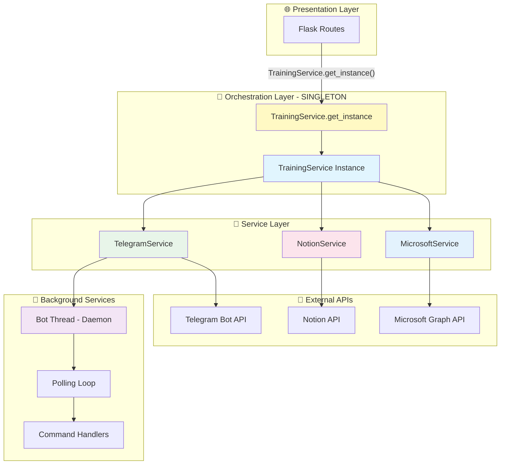

# 🎯 TrainingService - Documentazione Tecnica

**Orchestratore principale per gestione formazioni con pattern Singleton**

---

## 📋 Indice

1. [🏗️ Architettura Generale](#-architettura-generale)
2. [🎭 Pattern Singleton](#-pattern-singleton)
3. [🔧 Componenti Core](#-componenti-core)
4. [🔄 Workflow Operativi](#-workflow-operativi)
5. [📊 API Reference](#-api-reference)
6. [🚀 Esempi d'Uso](#-esempi-duso)
7. [⚙️ Configurazione](#️-configurazione)
8. [🧪 Testing](#-testing)

---

## 🏗️ Architettura Generale

### **Filosofia del TrainingService**
Il TrainingService è il **cuore pulsante** dell'applicazione Formazing - un **orchestratore Singleton** che coordina tutti i servizi specializzati per gestire il ciclo di vita completo delle formazioni, dal momento della programmazione fino alla raccolta del feedback.

### **Design Pattern Utilizzato**

```
🎯 TrainingService (Singleton Orchestrator)
├── 📊 NotionService           # Database formazioni
├── 📱 TelegramService          # Comunicazioni bot + notifiche
└── 🔷 MicrosoftService         # Calendar + Teams + Email
```

**Principi Architetturali:**
- 🎭 **Singleton Pattern**: Una sola istanza per tutta la vita dell'applicazione
- 🎯 **Facade Pattern**: API semplificata che nasconde complessità multi-servizio
- 💉 **Dependency Injection**: Servizi iniettati esplicitamente nel costruttore
- 🤖 **Automatic Lifecycle**: Bot Telegram avviato automaticamente all'inizializzazione
- 🔒 **Thread-Safe**: Lock per garantire sicurezza in ambienti multi-thread

---

### **🎯 Grafo Architettura Completa**



**🔄 Flow Operativo Tipico (Calendarizzazione Formazione):**

```
1. User → Flask Route (/confirm/notification/<id>)
         ↓
2. Route → TrainingService.get_instance() → Singleton recuperato
         ↓
3. TrainingService.send_training_notification(training_id)
         ↓
4. NotionService.get_formazione_by_id() → Recupera dati
         ↓
5. TrainingService._generate_training_code() → Genera codice univoco
         ↓
6. MicrosoftService.create_training_event() → Crea evento Teams + Email
         ↓ (FAIL-FAST se fallisce)
7. NotionService.update_formazione() → Aggiorna con codice + link + stato
         ↓
8. TelegramService.send_training_notification() → Notifica gruppi
         ↓
9. Return risultato completo a Route → Flash message + Redirect
```

---

## 🎭 Pattern Singleton

### **Perché Singleton?**

Il TrainingService utilizza il pattern Singleton per risolvere problemi critici:

**❌ Problema PRIMA del Singleton:**
```python
# Ogni route creava una nuova istanza
@app.route('/dashboard')
async def dashboard():
    training_service = TrainingService()  # Nuova istanza!
    # - Nuovo NotionService
    # - Nuovo TelegramService → Bot si avvia/stoppa continuamente!
    # - Nuovo MicrosoftService
    # = Spreco risorse + Bot instabile
```

**✅ Soluzione CON Singleton:**
```python
# Una sola istanza riutilizzata ovunque
@app.route('/dashboard')
async def dashboard():
    training_service = TrainingService.get_instance()  # Sempre la stessa!
    # - NotionService riutilizzato
    # - TelegramService riutilizzato → Bot SEMPRE ONLINE!
    # - MicrosoftService riutilizzato
    # = Performance + Stabilità
```

---

### **Implementazione Tecnica Singleton**

#### **Pattern: Double-Checked Locking Thread-Safe**

```python
import threading

class TrainingService:
    """Singleton thread-safe per orchestrazione formazioni."""
    
    # ============ SINGLETON STATE ============
    _instance = None                    # Istanza singleton (inizialmente None)
    _lock = threading.Lock()            # Lock per thread safety
    _bot_thread = None                  # Thread daemon bot Telegram
    
    def __new__(cls):
        """
        Garantisce una sola istanza (thread-safe).
        
        Pattern: Double-Checked Locking
        - Prima controlla _instance senza lock (performance)
        - Se None, acquisisce lock e ricontrolla (thread-safe)
        """
        if cls._instance is None:           # ① Check rapido (no lock)
            with cls._lock:                 # ② Acquisisce lock
                if cls._instance is None:   # ③ Ricontrolla (thread-safe)
                    cls._instance = super().__new__(cls)
        return cls._instance
    
    def __init__(self):
        """
        Inizializza servizi UNA SOLA VOLTA.
        
        Pattern: Initialization Guard
        - Flag _initialized previene re-inizializzazione
        - Servizi dipendenti creati solo al primo __init__
        """
        # ⚠️ CRITICAL: Evita reinizializzazione
        if hasattr(self, '_initialized'):
            return  # Già inizializzato, skip
        
        self._initialized = True
        
        # Inizializza servizi dipendenti
        self.notion_service = NotionService()
        self.telegram_service = TelegramService(
            token=Config.TELEGRAM_BOT_TOKEN,
            notion_service=self.notion_service,  # 💉 Dependency Injection
            groups_config_path=Config.TELEGRAM_GROUPS_CONFIG,
            templates_config_path=Config.TELEGRAM_TEMPLATES_CONFIG
        )
        self.microsoft_service = MicrosoftService()
        
        # 🤖 Avvia bot Telegram in background (solo processo principale)
        self._start_bot_if_main_process()
    
    @classmethod
    def get_instance(cls):
        """
        Factory method per ottenere istanza singleton.
        
        Usage nelle routes:
            training_service = TrainingService.get_instance()
        
        Returns:
            TrainingService: Istanza singleton (sempre la stessa)
        """
        return cls()  # __new__ garantisce singleton
```

---

### **🔐 Thread Safety & Flask Reloader Guard**

#### **Problema: Flask Development Mode**

Flask in debug mode avvia **2 processi**:
```
python run.py (debug=True)
    ↓
├── Processo RELOADER (watchdog cambiamenti file)
│   └── Crea TrainingService → Avvia Bot → Polling Telegram ✅
│
└── Processo WORKER (gestisce richieste HTTP)
    └── Crea TrainingService → Avvia Bot → Polling Telegram ❌
        └── ⚠️ CONFLICT! "terminated by other getUpdates request"
```

**Risultato senza guard**: Bot non funziona (conflitto polling)

#### **Soluzione: WERKZEUG_RUN_MAIN Guard**

```python
def _start_bot_if_main_process(self):
    """
    Avvia bot solo nel processo principale per evitare conflitti.
    
    Flask setta WERKZEUG_RUN_MAIN=true solo nel worker principale.
    Il reloader non ha questa variabile.
    """
    # Check: siamo nel processo reloader?
    is_reloader = os.environ.get('WERKZEUG_RUN_MAIN') != 'true'
    
    # Check: bot già avviato?
    if self._bot_thread is not None and self._bot_thread.is_alive():
        logger.info("⏭️ Bot Telegram già attivo, skip")
        return
    
    # Avvia bot solo nel worker principale
    if not is_reloader:
        self._start_bot_background()
        logger.info("🤖 Bot Telegram avviato in background")
    else:
        logger.info("⏭️ Bot Telegram skippato (processo reloader)")
```

#### **Bot Thread Management**

```python
def _start_bot_background(self):
    """
    Avvia bot Telegram in thread daemon separato.
    
    Pattern: Daemon Thread
    - Thread si chiude automaticamente quando app termina
    - Event loop asyncio indipendente per bot
    - Mantiene bot attivo con loop.run_forever()
    """
    def run_bot():
        try:
            # Crea event loop dedicato per bot
            loop = asyncio.new_event_loop()
            asyncio.set_event_loop(loop)
            
            # Avvia bot (async)
            loop.run_until_complete(self.telegram_service.start_bot())
            
            # Mantiene event loop attivo per comandi
            loop.run_forever()
        except Exception as e:
            logger.error(f"❌ Errore critico bot Telegram: {e}")
    
    # Thread daemon: si chiude con l'app (no cleanup manuale)
    self._bot_thread = threading.Thread(
        target=run_bot,
        daemon=True,
        name="TelegramBotThread"
    )
    self._bot_thread.start()
```

**Vantaggi Thread Daemon:**
- ✅ **Non-blocking**: Flask gestisce richieste HTTP senza aspettare bot
- ✅ **Auto-cleanup**: Termina automaticamente con l'app
- ✅ **Event loop isolato**: Nessun conflitto con Flask async routes
- ✅ **Always online**: Bot risponde a comandi anche quando app idle

---

## 🔧 Componenti Core

### **Servizi Dipendenti (Dependency Injection)**

Il TrainingService orchestra 3 servizi specializzati, iniettati esplicitamente:

#### **📊 NotionService - Database Layer**

**Responsabilità:**
- 📖 Recupero formazioni (filtrate per stato, data, periodo)
- ✏️ Aggiornamento formazioni (codice, link Teams, stato)
- 🔍 Query avanzate (by ID, by status, by date range)

**Operazioni utilizzate da TrainingService:**
```python
# Recupero formazione specifica
formazione = await self.notion_service.get_formazione_by_id(training_id)

# Aggiornamento multi-campo
await self.notion_service.update_formazione(training_id, {
    'Codice': generated_code,
    'Link Teams': teams_link,
    'Stato': 'Calendarizzata'
})
```

**Dipendenza:** Iniettato in `TelegramService` per comandi bot

---

#### **📱 TelegramService - Communication Layer**

**Responsabilità:**
- 📨 Invio notifiche formazioni (multi-gruppo)
- 📝 Invio richieste feedback (post-formazione)
- 🤖 Gestione comandi bot interattivi (`/oggi`, `/domani`, `/settimana`)
- 🎨 Formattazione messaggi da template YAML

**Operazioni utilizzate da TrainingService:**
```python
# Invio notifica calendarizzazione (main + area groups)
results = await self.telegram_service.send_training_notification(formazione)
# → Invia a: main_group + IT + R&D (se Area=['IT', 'R&D'])

# Invio richiesta feedback (solo area groups)
results = await self.telegram_service.send_feedback_notification(
    formazione, 
    feedback_link
)
# → Invia a: IT + R&D (NO main_group - evita spam)
```

**Dipendenza:** Richiede `NotionService` per comandi bot (dato al costruttore)

**Bot Lifecycle:**
- Avviato automaticamente da `TrainingService.__init__`
- Polling attivo 24/7 per comandi utente
- Thread daemon (cleanup automatico)

---

#### **🔷 MicrosoftService - Teams Integration Layer**

**Responsabilità:**
- 📅 Creazione eventi calendario Outlook
- 🔗 Generazione link Teams meeting automatici
- 📧 Invio email a mailing list multi-area
- 🎨 Formattazione eventi da template YAML

**Operazioni utilizzate da TrainingService:**
```python
# Creazione evento completo (Outlook + Teams + Email)
result = await self.microsoft_service.create_training_event(formazione)
# → Crea evento calendario con:
#    - Subject: "Python Avanzato"
#    - Body HTML con dettagli formazione
#    - Teams meeting link generato automaticamente
#    - Email a: it@jemore.it, rd@jemore.it (se Area=['IT', 'R&D'])

# Risultato
{
    'event_id': 'AAMkAGI2...',
    'teams_link': 'https://teams.microsoft.com/l/meetup-join/...',
    'attendee_emails': ['it@jemore.it', 'rd@jemore.it'],
    'calendar_link': 'https://outlook.office365.com/...',
    'is_online_meeting': True
}
```

**Dipendenza:** Indipendente (nessuna dipendenza da altri servizi)

**FAIL-FAST:** Se creazione Teams fallisce, workflow si blocca (no Notion update, no Telegram)

---

## 🔄 Workflow Operativi

### **📅 Workflow 1: Calendarizzazione Formazione Completa**

**Trigger:** User clicca "Conferma Calendarizzazione" nella preview (route: `/confirm/notification/<id>`)

**Step atomici:**

```
┌─────────────────────────────────────────────────────────────┐
│ 1️⃣ VALIDAZIONE FORMAZIONE                                   │
├─────────────────────────────────────────────────────────────┤
│ • Recupera formazione da Notion                             │
│ • Valida stato = "Programmata"                              │
│ • Verifica campi obbligatori (Nome, Data, Area)            │
└─────────────────────────────────────────────────────────────┘
                         ↓
┌─────────────────────────────────────────────────────────────┐
│ 2️⃣ GENERAZIONE CODICE UNIVOCO                               │
├─────────────────────────────────────────────────────────────┤
│ • Pattern: {Area}-{Nome}-{Anno}-{Periodo}-{Sequenza}       │
│ • Esempio: IT-Security_Training-2024-SPRING-01              │
│ • Aggiunge codice temporaneo a formazione per passaggio    │
└─────────────────────────────────────────────────────────────┘
                         ↓
┌─────────────────────────────────────────────────────────────┐
│ 3️⃣ MICROSOFT INTEGRATION (FAIL-FAST)                        │
├─────────────────────────────────────────────────────────────┤
│ • MicrosoftService.create_training_event()                  │
│   - Crea evento calendario Outlook                          │
│   - Genera Teams meeting link automatico                    │
│   - Invia email a mailing list aree (it@, rd@, etc.)       │
│ • ⚠️ CRITICAL: Se fallisce → STOP workflow (no Notion/TG)  │
└─────────────────────────────────────────────────────────────┘
                         ↓
┌─────────────────────────────────────────────────────────────┐
│ 4️⃣ AGGIORNAMENTO NOTION                                     │
├─────────────────────────────────────────────────────────────┤
│ • Campi aggiornati:                                         │
│   - Codice: IT-Security_Training-2024-SPRING-01             │
│   - Link Teams: https://teams.microsoft.com/...            │
│   - Stato: "Programmata" → "Calendarizzata"                │
└─────────────────────────────────────────────────────────────┘
                         ↓
┌─────────────────────────────────────────────────────────────┐
│ 5️⃣ NOTIFICA TELEGRAM MULTI-GRUPPO                           │
├─────────────────────────────────────────────────────────────┤
│ • Recupera formazione aggiornata con codice + link          │
│ • TelegramService.send_training_notification()             │
│   - Invia a main_group (tutti)                             │
│   - Invia a gruppi area specifici (IT, R&D, etc.)          │
│ • Template YAML con interpolazione variabili               │
└─────────────────────────────────────────────────────────────┘
                         ↓
┌─────────────────────────────────────────────────────────────┐
│ ✅ RISULTATO FINALE                                          │
├─────────────────────────────────────────────────────────────┤
│ {                                                           │
│   'codice_generato': 'IT-Security-2024-SPRING-01',         │
│   'teams_link': 'https://teams.microsoft.com/...',         │
│   'attendee_emails': ['it@jemore.it', 'rd@jemore.it'],     │
│   'telegram_results': {'main_group': True, 'IT': True},    │
│   'nuovo_stato': 'Calendarizzata'                          │
│ }                                                           │
└─────────────────────────────────────────────────────────────┘
```

**Gestione Errori:**
- ❌ **Stato invalido**: TrainingServiceError → Flash message + redirect dashboard
- ❌ **Microsoft fallisce**: MicrosoftServiceError → STOP immediato (no update Notion/Telegram)
- ❌ **Notion update fallisce**: NotionServiceError → Log + tentativo rollback
- ❌ **Telegram fallisce**: Warning log (non bloccante - formazione già calendarizzata)

---

### **📝 Workflow 2: Richiesta Feedback Post-Formazione**

**Trigger:** User clicca "Richiedi Feedback" per formazione completata (route: `/confirm/feedback/<id>`)

**Step atomici:**

```
┌─────────────────────────────────────────────────────────────┐
│ 1️⃣ VALIDAZIONE FORMAZIONE                                   │
├─────────────────────────────────────────────────────────────┤
│ • Recupera formazione da Notion                             │
│ • Valida stato = "Calendarizzata"                           │
│ • Verifica presenza codice generato                         │
└─────────────────────────────────────────────────────────────┘
                         ↓
┌─────────────────────────────────────────────────────────────┐
│ 2️⃣ GENERAZIONE LINK FEEDBACK                                │
├─────────────────────────────────────────────────────────────┤
│ • Pattern: https://forms.office.com/feedback-{codice}       │
│ • Esempio: https://forms.office.com/feedback-IT-Security... │
│ • TODO: Integrazione con sistema reale (Microsoft Forms)   │
└─────────────────────────────────────────────────────────────┘
                         ↓
┌─────────────────────────────────────────────────────────────┐
│ 3️⃣ INVIO TELEGRAM FEEDBACK (SOLO AREA GROUPS)               │
├─────────────────────────────────────────────────────────────┤
│ • TelegramService.send_feedback_notification()             │
│ • ⚠️ IMPORTANTE: NO main_group (evita spam)                 │
│ • Target: SOLO gruppi area specifica (IT, R&D, etc.)       │
│ • Template feedback con link cliccabile                     │
└─────────────────────────────────────────────────────────────┘
                         ↓
┌─────────────────────────────────────────────────────────────┐
│ 4️⃣ AGGIORNAMENTO STATO NOTION                               │
├─────────────────────────────────────────────────────────────┤
│ • Stato: "Calendarizzata" → "Conclusa"                      │
│ • Formazione archiviata nel database                        │
└─────────────────────────────────────────────────────────────┘
                         ↓
┌─────────────────────────────────────────────────────────────┐
│ ✅ RISULTATO FINALE                                          │
├─────────────────────────────────────────────────────────────┤
│ {                                                           │
│   'feedback_link': 'https://forms.office.com/...',         │
│   'telegram_results': {'IT': True, 'R&D': True},           │
│   'nuovo_stato': 'Conclusa'                                │
│ }                                                           │
└─────────────────────────────────────────────────────────────┘
```

**Gestione Errori:**
- ❌ **Stato invalido**: TrainingServiceError → Flash message
- ❌ **Codice mancante**: TrainingServiceError → Formazione non calendarizzata
- ❌ **Telegram fallisce**: Warning log (non critico - stato aggiornato comunque)

---

### **🔍 Workflow 3: Generazione Preview (Safe Mode)**

**Trigger:** User clicca "Notifica" per formazione programmata (route: `/preview/notification/<id>`)

**Step atomici:**

```
┌─────────────────────────────────────────────────────────────┐
│ 1️⃣ VALIDAZIONE & RECUPERO DATI                              │
├─────────────────────────────────────────────────────────────┤
│ • Recupera formazione da Notion                             │
│ • Valida stato = "Programmata"                              │
└─────────────────────────────────────────────────────────────┘
                         ↓
┌─────────────────────────────────────────────────────────────┐
│ 2️⃣ GENERAZIONE CODICE TEMPORANEO (NO WRITE)                 │
├─────────────────────────────────────────────────────────────┤
│ • Genera codice per preview                                 │
│ • ⚠️ Non salvato in Notion (solo memoria)                   │
│ • Copia formazione con codice temporaneo                    │
└─────────────────────────────────────────────────────────────┘
                         ↓
┌─────────────────────────────────────────────────────────────┐
│ 3️⃣ PREVIEW MESSAGGI TELEGRAM (NO INVIO)                     │
├─────────────────────────────────────────────────────────────┤
│ • Per ogni area: TelegramFormatter.format_training_message()│
│ • Genera preview messaggio con:                             │
│   - Area target (IT, R&D, main_group)                       │
│   - Chat ID gruppo                                          │
│   - Messaggio HTML formattato                               │
│ • ✅ SAFE: Nessun invio reale                               │
└─────────────────────────────────────────────────────────────┘
                         ↓
┌─────────────────────────────────────────────────────────────┐
│ 4️⃣ PREVIEW EMAIL MICROSOFT (NO INVIO)                       │
├─────────────────────────────────────────────────────────────┤
│ • MicrosoftService.email_formatter.format_subject()         │
│ • MicrosoftService.email_formatter.format_calendar_body()   │
│ • Lista destinatari da config/microsoft_emails.json         │
│ • ✅ SAFE: Nessun evento creato, nessuna email inviata      │
└─────────────────────────────────────────────────────────────┘
                         ↓
┌─────────────────────────────────────────────────────────────┐
│ ✅ RISULTATO PREVIEW                                         │
├─────────────────────────────────────────────────────────────┤
│ {                                                           │
│   'training': {...},                                        │
│   'messages': [                                             │
│     {'area': 'main_group', 'message': '🌐 Nuova...'},      │
│     {'area': 'IT', 'message': '📅 Nuova formazione...'}    │
│   ],                                                        │
│   'codice_generato': 'IT-Security-2024-SPRING-01',         │
│   'email': {                                                │
│     'subject': 'Sicurezza Informatica Avanzata',           │
│     'body_preview': '🎓 Formazione Programmata...',        │
│     'attendee_emails': ['it@jemore.it']                    │
│   }                                                         │
│ }                                                           │
└─────────────────────────────────────────────────────────────┘
```

**Sicurezza Preview:**
- ✅ **Read-only**: Nessuna modifica a Notion
- ✅ **No invii**: Nessun messaggio Telegram, nessuna email
- ✅ **No Teams**: Nessun evento creato, nessun link generato
- ✅ **Safe testing**: Utente vede esattamente cosa verrà inviato

---

## 📊 API Reference

### **🎯 Metodi Pubblici (Interfaccia Esterna)**

#### **`get_instance() -> TrainingService`** (classmethod)

**Scopo:** Factory method per ottenere istanza singleton  
**Utilizzato da:** Tutte le Flask routes  

**Returns:** Istanza singleton TrainingService (sempre la stessa)

**Example:**
```python
# In Flask route
@app.route('/dashboard')
async def dashboard():
    training_service = TrainingService.get_instance()
    # Usa training_service per operazioni
```

---

#### **`generate_preview(training_id: str) -> Dict`** (async)

**Scopo:** Genera anteprima completa calendarizzazione SENZA invii  
**Utilizzato da:** Route `/preview/notification/<id>`

**Validazioni:**
- ✅ Formazione deve esistere
- ✅ Stato deve essere "Programmata"

**Parameters:**
- `training_id` (str): ID formazione da Notion

**Returns:**
```python
{
    'training': {
        'Nome': 'Python Avanzato',
        'Data/Ora': '15/10/2024 14:30',
        'Area': ['IT'],
        'Stato': 'Programmata'
    },
    'messages': [
        {
            'area': 'main_group',
            'chat_id': '-1001234567890',
            'message': '🌐 <b>Nuova formazione!</b>\n\n...'
        },
        {
            'area': 'IT',
            'chat_id': '-1001234567891',
            'message': '📅 <b>Nuova formazione per IT!</b>\n\n...'
        }
    ],
    'codice_generato': 'IT-Python_Avanzato-2024-SPRING-01',
    'email': {
        'subject': 'Python Avanzato',
        'body_preview': '🎓 Formazione Programmata\n\n...',
        'attendee_emails': ['it@jemore.it']
    }
}
```

**Raises:**
- `TrainingServiceError`: Se formazione non trovata o stato invalido

---

#### **`send_training_notification(training_id: str) -> Dict`** (async)

**Scopo:** Workflow completo calendarizzazione formazione  
**Utilizzato da:** Route `/confirm/notification/<id>`

**Steps:**
1. Valida formazione (stato "Programmata")
2. Genera codice univoco
3. Crea evento Teams + invia email (FAIL-FAST se fallisce)
4. Aggiorna Notion (codice + link + stato)
5. Invia notifiche Telegram multi-gruppo

**Parameters:**
- `training_id` (str): ID formazione da Notion

**Returns:**
```python
{
    'codice_generato': 'IT-Python_Avanzato-2024-SPRING-01',
    'teams_link': 'https://teams.microsoft.com/l/meetup-join/...',
    'attendee_emails': ['it@jemore.it', 'rd@jemore.it'],
    'telegram_results': {
        'main_group': True,
        'IT': True,
        'R&D': True
    },
    'nuovo_stato': 'Calendarizzata'
}
```

**Raises:**
- `TrainingServiceError`: Se formazione non valida o già processata
- `MicrosoftServiceError`: Se creazione Teams fallisce (fail-fast)
- `NotionServiceError`: Se aggiornamento Notion fallisce

**IMPORTANT:** Se Microsoft fallisce, Notion NON viene aggiornato (transazione atomica)

---

#### **`generate_feedback_preview(training_id: str) -> Dict`** (async)

**Scopo:** Genera anteprima feedback SENZA invii  
**Utilizzato da:** Route `/preview/feedback/<id>`

**Validazioni:**
- ✅ Formazione deve esistere
- ✅ Stato deve essere "Calendarizzata"
- ✅ Deve avere codice generato

**Parameters:**
- `training_id` (str): ID formazione da Notion

**Returns:**
```python
{
    'training': {
        'Nome': 'Python Avanzato',
        'Codice': 'IT-Python_Avanzato-2024-SPRING-01',
        'Area': ['IT'],
        'Stato': 'Calendarizzata'
    },
    'messages': [
        {
            'area': 'IT',
            'chat_id': '-1001234567891',
            'message': '📝 <b>Feedback richiesto!</b>\n\n...'
        }
    ]
}
```

**Note:** Feedback va SOLO a gruppi area (NO main_group per evitare spam)

**Raises:**
- `TrainingServiceError`: Se formazione non valida o codice mancante

---

#### **`send_feedback_request(training_id: str) -> Dict`** (async)

**Scopo:** Invia richiesta feedback + aggiorna stato a "Conclusa"  
**Utilizzato da:** Route `/confirm/feedback/<id>`

**Steps:**
1. Valida formazione (stato "Calendarizzata")
2. Genera link feedback personalizzato
3. Invia via Telegram (solo area groups)
4. Aggiorna stato → "Conclusa"

**Parameters:**
- `training_id` (str): ID formazione da Notion

**Returns:**
```python
{
    'feedback_link': 'https://forms.office.com/feedback-IT-Python...',
    'telegram_results': {
        'IT': True,
        'R&D': False  # Esempio: invio fallito
    },
    'nuovo_stato': 'Conclusa'
}
```

**Raises:**
- `TrainingServiceError`: Se formazione non calendarizzata
- `NotionServiceError`: Se aggiornamento stato fallisce

---

### **🔒 Metodi Privati (Core Implementation)**

#### **`_generate_training_code(training: Dict) -> str`**

**Scopo:** Genera codice formazione univoco

**Pattern:** `{Area}-{Nome}-{Anno}-{Periodo}-{Sequenza}`

**Example:**
```python
training = {
    'Area': ['IT'],
    'Nome': 'Sicurezza Informatica Avanzata',
    'Periodo': 'SPRING'
}

code = self._generate_training_code(training)
# → "IT-Sicurezza_Informatica_Avanzata-2024-SPRING-01"
```

**Normalizzazioni:**
- Spazi → `_`
- Trattini → `_`
- Multi-area → usa prima area della lista

**TODO:** Implementare sequenza intelligente basata su database (attualmente fixed "01")

---

#### **`_create_teams_meeting(training: Dict) -> Dict`** (async)

**Scopo:** Crea meeting Teams tramite Microsoft Graph API

**Delega a:** `MicrosoftService.create_training_event()`

**Input:** Formazione con campi: Nome, Data/Ora, Area, Codice

**Output:**
```python
{
    'teams_link': 'https://teams.microsoft.com/l/meetup-join/...',
    'event_id': 'AAMkAGI2ZmM2NDY5...',
    'attendee_emails': ['it@jemore.it', 'rd@jemore.it'],
    'calendar_link': 'https://outlook.office365.com/...'
}
```

**FAIL-FAST:** Se fallisce, solleva `MicrosoftServiceError` (workflow si blocca)

---

#### **`_generate_feedback_link(training: Dict) -> str`**

**Scopo:** Genera link feedback personalizzato

**Pattern:** `https://forms.office.com/feedback-{codice}`

**Example:**
```python
training = {'Codice': 'IT-Python_Avanzato-2024-SPRING-01'}
link = self._generate_feedback_link(training)
# → "https://forms.office.com/feedback-IT-Python_Avanzato-2024-SPRING-01"
```

**TODO:** Integrare con sistema reale Microsoft Forms (attualmente placeholder)

---

## ⚙️ Configurazione

### **Environment Variables (.env)**

```env
# Notion Configuration
NOTION_TOKEN=secret_notion_integration_token
NOTION_DATABASE_ID=279caf2ee5f38044ab08f8b22ca3771d

# Telegram Configuration
TELEGRAM_BOT_TOKEN=123456789:ABCdefGHIjklMNOpqrSTUvwxyz
TELEGRAM_GROUPS_CONFIG=config/telegram_groups.json
TELEGRAM_TEMPLATES_CONFIG=config/message_templates.yaml

# Microsoft Graph Configuration
AZURE_TENANT_ID=your-tenant-id
AZURE_CLIENT_ID=your-client-id
AZURE_CLIENT_SECRET=your-client-secret
AZURE_USER_EMAIL=lucadileo@jemore.it
MICROSOFT_EMAILS_CONFIG=config/microsoft_emails.json
CALENDAR_TEMPLATES_CONFIG=config/calendar_templates.yaml
```

---

### **Inizializzazione App (app/__init__.py)**

```python
from flask import Flask
from app.services.training_service import TrainingService

def create_app():
    """Factory Flask app con inizializzazione singleton."""
    app = Flask(__name__)
    
    # Carica configurazione
    app.config.from_object(Config)
    
    # Registra routes
    from app.routes import main
    app.register_blueprint(main)
    
    # ✅ CRITICAL: Inizializza TrainingService (e bot Telegram)
    logger.info("🎯 Inizializzazione TrainingService Singleton...")
    training_service = TrainingService.get_instance()
    logger.info("✅ TrainingService pronto (bot Telegram avviato)")
    
    return app
```

**Quando viene chiamato `get_instance()`:**
1. Prima volta → crea istanza, inizializza servizi, avvia bot
2. Chiamate successive → ritorna stessa istanza (già pronta)

---

## 🔗 Riferimenti

### **Documenti Correlati**
- [NotionService Documentation](notion-service.md) - Database layer
- [TelegramService Documentation](bot-telegram.md) - Communication layer
- [MicrosoftService Documentation](microsoft-service.md) - Teams integration
- [Singleton Refactor Changelog](CHANGELOG-singleton-refactor.md) - Dettagli refactoring

### **Pattern & Architetture**
- **Singleton Pattern**: [Wikipedia](https://refactoring.guru/design-patterns/singleton)
- **Facade Pattern**: [Refactoring Guru](https://refactoring.guru/design-patterns/facade)
- **Dependency Injection**: [Martin Fowler](https://martinfowler.com/articles/injection.html)

### **Testing**
- [Testing Guide](testing/README.md) - Panoramica test suite
- [E2E Integration Testing](testing/e2e-integration-testing.md) - Test workflow completi

---

**TrainingService rappresenta il cuore orchestratore di Formazing** - un'architettura Singleton robusta che garantisce stabilità, performance e coordinamento impeccabile tra tutti i servizi dell'ecosistema formazioni. 🎯🚀

---

*Documentazione creata il 07 Ottobre 2025 - Versione 1.0*
